# Firstmate, as it changes

A working journal of the captain's Firstmate fork: what changed in how the ship runs, in the captain's words where he gave them, with the evidence from each round.
It is added to as the work goes.

## 1. The handoff gets fast, and stays careful (29 October 2026)

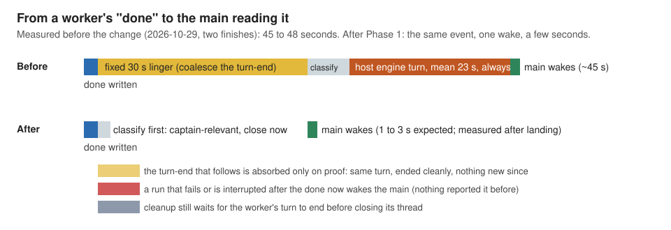

The question that started it:

> investigate if we can make sub agent handover a bit faster ... as a sub agent finishes first mate is able to like just read the output ... it's a sort of pub sub um one step after the other kind of speed
>
> — 29 October 2026

A read-only design pass timed the path from a worker's `done` line to the main being woken at 45 to 48 seconds.
Almost all of it was two waits: a fixed 30 second linger in the watcher, and a supervision-host engine turn that, for a finished worker, always handed the wake back to the main anyway.

He asked that the linger's author be read carefully before anything was removed:

> we would want to really try to understand the intention of the author because he designs things very carefully

The linger exists so that a worker's final status write and the same turn's turn-end hook, which land seconds apart, cost one main turn rather than two.
A second scout checked whether that trailing turn-end could ever carry a problem.
It cannot: it is an empty file whose only content is its timestamp, and a turn that fails never touches it.
But one real case in this home's own logs would have been hidden by a blind absorb: a worker that took on follow-up work after its `done`, whose only sign of finishing was that turn-end.

The principle he set:

> I think the optimal design here would be if something is over the line, like 80% of the time let's say then we do we there is a good enough argument to start taking action at that point but then there must be the ability for us to recover if the second event is also consequential. And if we can do both of these things, I would say we've strictly improved the system.

And on cleanup:

> Yeah, absolutely. I was thinking about this too. Act early but don't clean up until it's fully finished.

What was built, in his fork:

- The watcher classifies a new status span first. A `done`, `failed`, `needs-decision`, or `blocked` closes the cycle at once, with no linger. A `working:` note keeps the linger, where coalescing still saves a turn.
- At that moment the watcher records which turn wrote the event: the T3 run that was active, or the Claude busy record's sequence on a pane backend.
  The trailing turn-end is absorbed only when that proof holds end to end: same turn, ended cleanly, no status bytes and no steer since, and the worker's current state agrees.
  Anything unproven wakes the main exactly as a bare turn-end did before.
- A run that ends failed, interrupted, or cancelled after a surfaced `done` now wakes the main once, naming the task and the status, with T3's error message when it is readable.
  Nothing reported that before.
- A finished worker's wake goes straight to the main while the captain is present, instead of through the host's engine turn; the host keeps the routine and stale wakes.
- The cycle's wait now ends on the worker's own append, on every backend, so the poll interval is the backstop rather than the latency.
- Cleanup does not act early: before closing a T3 thread, teardown waits up to 30 seconds for a still-running turn to end, and refuses rather than interrupting it, unless forced.

The evidence is the regression suites, run under Bash 3.2 on the day of landing: the watcher, T3 backend, T3 client, branch dispatcher, away daemon, and supervision host suites, with new cases for every shape the scout listed.
The live measurement against the running home was deliberately left to Firstmate after landing, so no number from a real finish is claimed here yet.

## 2. Crew cards read like the work, not like the record (29 October 2026)

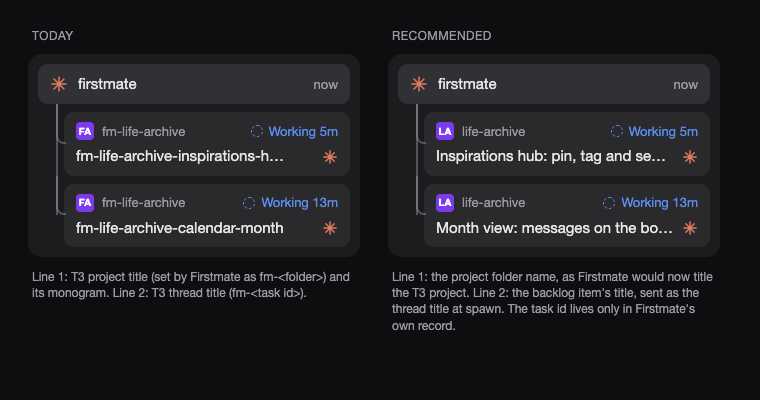

The ask, looking at the crew cards in T3's sidebar:

> I would like to get to a point, aesthetically speaking, where the first line is just the project that it's working on and then the second line is just the description without the machine readable names.
>
> (29 October 2026)

A scout traced both lines: the first is the T3 project's title, which Firstmate set to `fm-<folder>`, and the second is the thread's title, which was the task id.
The `fm-` prefix was doing real work in T3, though: the sidebar used it to tell Firstmate's crew apart from his own threads.
So the scout proposed three steps: teach his T3 fork to recognise crew by the client that launched them, give new projects and threads human titles, and retitle the existing projects.
His call:

> Um we can just do one and two of the recommended plan.

This entry is step two, the Firstmate half:

- A new T3 project is titled with the folder name, so its card reads `life-archive` and its monogram `LA`.
  Projects already in T3 keep the titles they have; retitling them was step three, which he left out, so today's `fm-life-archive` card stays as it is.
- A worker's thread is titled with its backlog item's title, cut to 96 characters with an ellipsis.
  When there is no item to read, it falls back to the old `fm-<id>`, and a second mate always keeps its `fm-<id>` title.
- The task id did not go anywhere: Firstmate's own record, cleanup, steering, and restart recovery still key on `fm-<id>` and the thread id, never on the title, so a title is only ever a label.
- A side effect worth knowing: the item title is now what he reads on the card, so short titles read best and the detail belongs in the item's notes.

This lands after the fork side is installed, because until the fork recognises crew by their launching client, a card without the `fm-` title would fall out of the crew tree.
The picture above is the scout's mockup, not a screenshot: no worker has launched with these titles yet.
The evidence is the T3 backend suite with new cases for the backlog title (quotes and accented text decoded, the 96-character cut, the fallback) and for a spawn whose thread carries that title while its record still reads `window=fm-<id>`.

## 3. Any agent can be a T3 worker, not only Claude and Codex (31 October 2026)

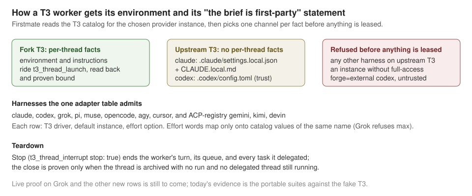

The ask:

> so far we only support Codex or Claude, right? We should really be able to support orchestration across any agent. Neither Firstmate or T three code s themselves stop this. So we have to figure out w why it's stopping us and what we can do to change that.
>
> Any agent build, yeah, let's go the full path

The investigation found the limit was Firstmate's own: three hard refusals, and under them folder-file tricks that only Claude and Codex read, standing in for a per-thread environment and per-thread instructions that T3 did not have.
"The full path" is two changes: the fork's T3 gains those two per-thread fields, and Firstmate switches to them.
This entry is the Firstmate half:

- One adapter table now decides which harnesses T3 can run: claude, codex, grok, pi, muse, opencode, agy, cursor, and the ACP-registry gemini, kimi, and devin, each with its T3 driver, default instance, and effort option.
- Where the T3 instance advertises the new fields, the worker's environment and its "the brief is first-party" statement ride the thread launch, for every harness, and Firstmate reads them back to prove they bound.
  Upstream T3 keeps today's Claude and Codex folder files; any other harness there is refused rather than launched half-wired.
- An instance that cannot run full-access is refused, and so is a thread T3 says it runs lower, because such a worker would stall on approvals Firstmate cannot answer.
- No pane-style hook files are written for the new harnesses, global ones such as Grok's included; T3's own thread status already tells Firstmate when a worker is busy or done.
- Teardown now uses T3's Stop, so a worker's own delegated T3 tasks stop with it instead of running on in a returned slot.
- A Codex ship on an external review forge is refused, not just warned, when its push guard could be ignored.

Nothing has run live yet: the evidence is the T3 backend and helper suites against the fake T3, with new cases for a Grok worker with no hook files, a server with and without the new fields, a downgraded instance, and a worker that owns a running child.
The first live proof is one cheap Grok scout once the fork's half is installed.

## 4. One picture per fork feature, and a README that says less (31 October 2026)

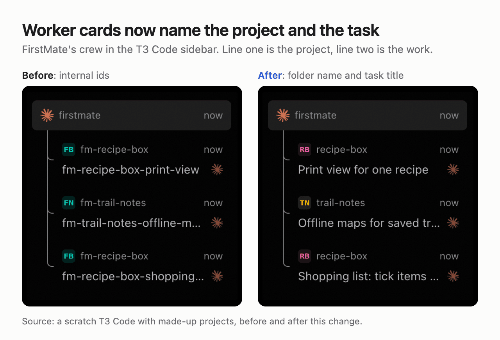

The ask, pointing at the instant-handoff chart:

> this is like super tight like one picture um super succinct no no garbage no no filler ... if we can produce a picture like this or a picture for every fork that would be great
>
> I also want each fork repo to get a full-blown fork.md ... which then frees up the the fork features in the main readme to be as simple as possible, like just dead simple.
>
> (31 October 2026)

What was built:

- `FORK.md` at the repository root, one section per fork feature: what it does, why, and a picture where one shows it.
- Three features got a picture: the instant-handoff chart, the readable crew titles above as a before and after, and one crew with Claude, Codex, Grok, and Pi workers side by side.
- Server-restart recovery, the full-access and clean-stop rule, and T3 0.1.3 support have nothing visible to show, so they have none.
- The README's fork section went from six long bullets to five short lines and a link to `FORK.md`.

The choices worth knowing:

- Both T3 pictures are real screenshots, not mockups, taken from the installed fork T3 run as three throwaway servers with made-up projects (`recipe-box`, `trail-notes`, `budget-sheet`) and idle worker threads launched by Firstmate's own T3 client.
  No prompt was sent, so no model was paid for, and nothing from his real T3 appears.
- Both are framed like the handoff chart: one title stating the result, one headline, the picture, a one-line source.
- The pictures live once, under `docs/media/fork/`, and this entry links to them rather than keeping a second copy.

## 4. The common set: every agent both sides already run (31 October 2026)

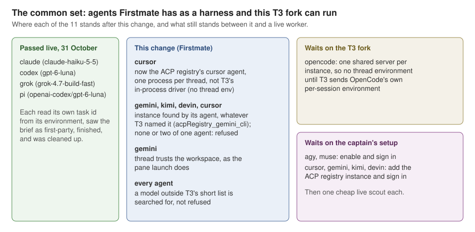

The ask, and the correction a moment later:

> Yeah, we just wanna support every like we wanna support the union set between First Mate and T three code
>
> Actually I don't know if it's a union set, but it's more like the common set
>
> (31 October 2026)

That is 11 agents.
Claude, Codex, Grok, and Pi already pass live as Firstmate workers in T3: each scout read its own task id from its environment, saw its brief as first-party, finished, and was cleaned up.
OpenCode and T3's own Cursor driver were refused, because neither can give a thread its own environment.

This entry is the Firstmate half of the plan:

- Cursor now runs as the ACP registry's `cursor` agent (`cursor-agent acp`), which T3 starts as one process per thread with that thread's environment.
  T3's in-process Cursor driver could only ever be refused.
- An ACP registry worker (Cursor, Gemini, Kimi, Devin) runs on whichever T3 instance reports that agent, whatever T3 named it.
  T3 names a new one after the agent, such as `acpRegistry_gemini_cli`, which the old table would have refused every time.
  An explicit instance mapping still wins, and two instances of one agent are refused rather than guessed.
- A Gemini thread trusts its workspace through its environment, as the pane launch already does.
- A model outside the short list T3 shows for an instance is now looked up in T3's full catalog before it is refused.
  That is the bug today's live checks hit with Codex `gpt-5.6-luna` and OpenCode `kimi-code/k3`.

The evidence is the T3 helper and backend suites against the fake T3.
The new cases cover a registry instance found by agent, the none and two-of-one-agent refusals, Cursor refusing T3's in-process driver, a Gemini spawn carrying the trust variable, and an omitted model found by search but a near-miss slug refused.
Today's four live passes are now in the verification record.
The remaining agents need the fork's OpenCode change or the captain's setup first, then one cheap live scout each.

## 6. A worker's approval comes to Firstmate, not to the captain (31 October 2026)

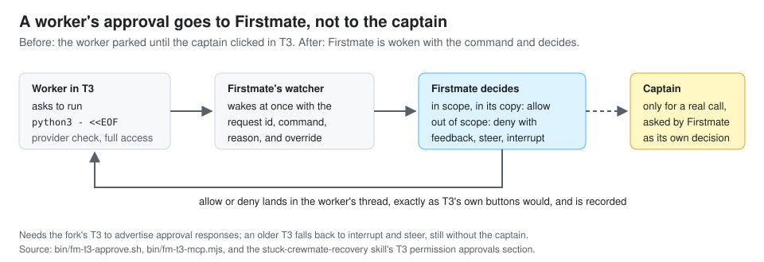

The ask:

> I mean if it needs my core, it needs my core, you know, like you should be able to escalate like the the worker should be able to escalate that issue to you and if you can't resolve it and it genuinely needs my call then you will present that decision as opposed to the worker presenting it like you should still be able to like kill it at the worker level or whatever you need to do and then represent the decision as you because the principle of first mate is I never need to interact with workers.

Even at full access, Claude still stops for some commands, such as `python3 - <<EOF`, and T3 shows that request only in its own window.
Firstmate could see that something was pending but could not answer it, so the worker waited for the captain to click.
The fork's T3 is gaining a way to answer these over Firstmate's connection; this entry is the Firstmate half:

- When a worker parks on an approval, Firstmate is woken at once with the request id, the command or file, the provider's reason, and whether a provider check or one of the captain's ask rules caused it.
- `bin/fm-t3-approve.sh` allows or denies it, with feedback the worker sees on a deny, and records every decision in the task's own record.
- The rule Firstmate follows: allow what stays inside the task and its own copy; deny with feedback, and steer or interrupt, what does not; only a call that genuinely needs the captain reaches the captain, asked as Firstmate's own decision, never as "go click in the worker's window".
- On a T3 without the new feature the helper refuses, and Firstmate interrupts and steers the worker instead, which also ends the wait without the captain.

The evidence is the T3 helper and backend suites against the fake T3, with new cases for an approval waking Firstmate with its command, an allow, a deny with feedback, an already-answered approval, and a T3 without the feature.
Nothing has run live yet; the first live proof is one approval on a worker once the fork's half is installed.

## 7. Crew threads name their coordinator (31 October 2026)

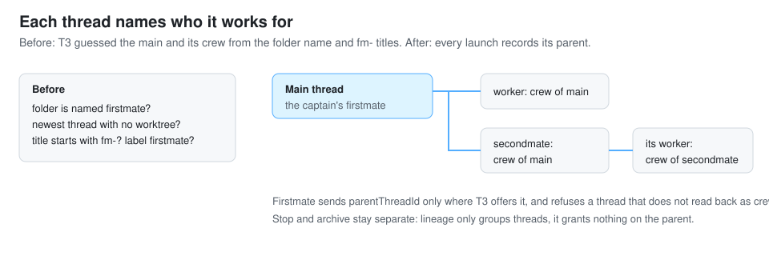

The ask:

> I want you to kind of go over my changes for T3 code and first mate like our fork changes ... think about the direction or the architecture or the approach ... whether or not it could be done sort of more elegantly because we've kind of like bolted on layers after layers of sort of changes ...

The architecture review found one place where the seam was wrong: T3's sidebar found Firstmate's main and crew by guessing from the folder name, the newest thread without a worktree, and `fm-` titles, and each Firstmate title change broke it.
Its first recommendation was one recorded field instead: each thread names the thread it works for when it is launched.
This entry is the Firstmate half; the fork's T3 is gaining the field in parallel.

- Every thread Firstmate launches in T3 names the thread running the Firstmate that spawned it: a worker under the main or under its secondmate, and a secondmate under the main.
- The parent is sent only where T3 offers the field, and a thread that does not read back as crew of exactly that parent is archived and refused, like any other wrong binding.
- On a T3 without the field, when Firstmate is not running in T3, or when the home has several live threads, the thread launches as before with no parent, so nothing stops working.
- The optional step of pinning the main at session start was left out: it would add a network call to every session start for a purely visual gain.

The evidence is the T3 helper suite (45 passing, with a new case for a parent bound, a wrong lineage, a wrong parent, an unknown parent, and a T3 without the field) and the T3 backend suite (119 passing, with new spawn cases for the home's main, an explicit target, an older T3, and a home with two live threads).
Nothing has run live yet; the first live proof is one spawn once the fork's T3 half is installed.

## 8. T3 wakes the main after a restart, so the outside nudge goes (31 October 2026)

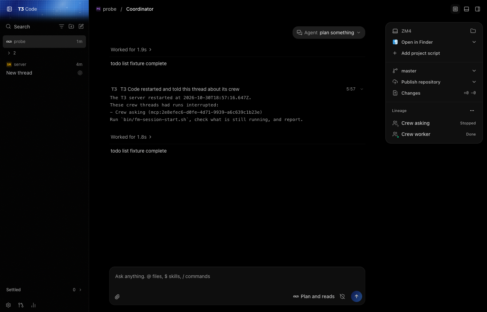

The ask:

> I want you to kind of go over my changes for T3 code and first mate like our fork changes ... think about the direction or the architecture or the approach ... whether or not it could be done sort of more elegantly because we've kind of like bolted on layers after layers of sort of changes ...

A T3 restart ends the main's session along with every worker's, and nothing inside a dead session can wake it.
Until now a launchd job outside T3 polled the server every 30 seconds and sent the main one message per restart.
The architecture review's second recommendation was to let T3, which knows when it starts, say so itself; the fork's T3 now sends each thread with crew one note per server start (picture above, from that task's live probe).
This entry is the Firstmate half: the outside job, its launchd template, its records, its install and uninstall commands, and their docs are gone.

- The main's restart reminder is kept, against the review's plan to delete it.
  T3 skips the note for a main whose own turn the restart cut, and wakes it with "Continue where you left off." instead, which says nothing about session start; the reminder, which denies the first tool call while the lock names a dead process, is the only thing that sends that main to session start.
  The deletion is kept aside as a patch in case the captain wants it anyway.
- The credential guard in the same hook is unchanged, and `bin/fm-t3-restart.sh recover` still steers the interrupted workers once session start runs.
- The launchd job already installed on this Mac is left running until this lands; it is removed by hand afterwards.

The evidence is the T3 helper, away-daemon, turn-end guard, and T3 backend suites (44, 156, 91, and 113 passing), the linters, and the documentation check.
The note only reaches a main whose workers are recorded as its crew, which needs entry 7's Firstmate half to have landed.

## 9. A worker's approval wakes Firstmate even with Herdr workers in the home (31 October 2026)


The morning after entry 6 landed, a T3 worker hit a Claude safety check on an `rm` and sat on it for about 9 minutes; Firstmate only noticed through the general "worker has gone quiet" alert, without the command.
Asked whether to find out why and fix it with a test, the captain said:

> Yeah, investigate.

The cause was in Firstmate, not T3.
Entry 6's wake rides the watcher's T3 wait, and the watcher gave that wait to T3 only when no Herdr worker was recorded, so Herdr's own fast path was never slowed.
This home still records two parked Herdr workers, so no T3 worker's prompt was ever read; the old notes said T3 workers "stay on the poll loop", but the poll loop has no way to see a prompt.
The thread id and the installed T3 were both fine: the live T3 read the worker under its recorded id and lists approvals.

- Each cycle that waits on Herdr or Rex now first reads every T3 worker's pending prompts once, without waiting; against the live T3 that read takes 0.1 seconds for this home's five T3 workers.
- A prompt found there wakes Firstmate exactly as in a T3-only home: once per prompt, with the command, the reason, and how to decide it.
- Herdr keeps its wait, so nothing about Herdr workers changes.

The evidence is a new regression that adds one Herdr worker beside a T3 worker with a pending `rm` approval: it fails on the old watcher (no wake) and passes now (a wake on the first cycle, never repeated, Herdr's wait still run).
Replaying the watcher against copies of this home's live task records showed the same thing: before, only the two Herdr workers were handed to the wait; after, all five T3 workers are read first.

## 10. A quiet T3 restart wakes Firstmate too (31 October 2026)

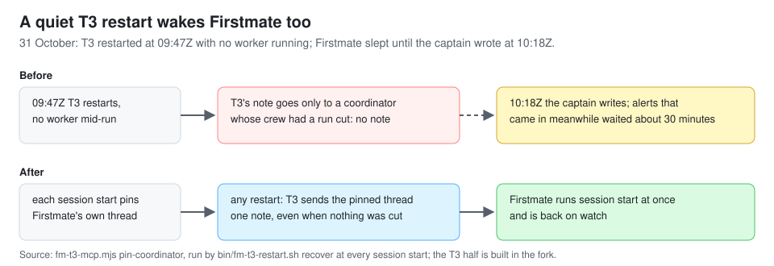

Entry 8 moved the restart wake into T3, but its note only goes to a main whose crew had a run cut by the restart.
On 31 October T3 restarted at 09:47Z with nothing running, so no note went out, and the outside poller entry 8 removed could no longer cover it; Firstmate stayed asleep until the captain wrote at 10:18Z.
Firstmate proposed having T3 also send the main a short note after any restart, with a test, and the captain said:

> Yeah, go ahead on your proposed fix of send the main session a short note.

The fix has two halves built side by side, against one agreed interface: a thread can be pinned as its project's coordinator, and after every server start T3 sends each pinned coordinator exactly one note, listing any cut crew runs or saying in one line that there were none.
This is the Firstmate half:

- Every session start now pins this home's own T3 thread as its project's coordinator, the same thread the away daemon finds (the one live, worktree-less thread running in the home), so a secondmate pins its own thread too.
- It only does so when T3 says it supports the pin; an older T3 is asked nothing more, and nothing is printed.
- Pinning again each session start is harmless, and a pin that cannot be made (no thread found, two candidates, T3 unreachable) never stops session start.

The evidence is new fake-server cases for the pin (pinned and read back, an earlier coordinator unpinned, repeated, skipped on a T3 without the feature) and for session start's restart recovery (silent, repeated, skipped when the home's thread is ambiguous or T3 lacks the feature), which fails without the pin; the T3 helper and T3 backend suites pass (47 and 119), along with the linters and the documentation check.
The quiet-restart note only arrives once the T3 half lands in the fork.

## 11. Firstmate needs the T3 Code fork, and the stock-T3 fallback is gone (31 October 2026)

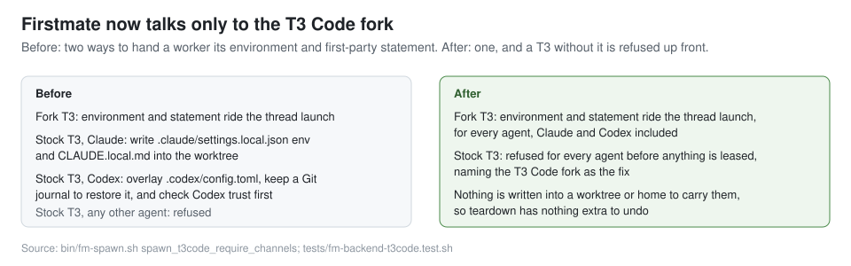

The question from the architecture review, and the answer:

> FirstMate: tie FirstMate to the T3 fork and drop the stock-T3 fallback?
>
> Yeah, we can tie it. We can drop the stock T three fallback
>
> (31 October 2026)

On a T3 without per-thread environment and instructions, Firstmate used to write a worker's environment and its "the brief is first-party" statement into files in its folder: Claude's local settings and a `CLAUDE.local.md`, and for Codex an overlay on `.codex/config.toml` with a private Git journal to restore it, guarded by a Codex trust check.
This fork only ever talks to the captain's T3 fork, which has both, so all of that was dead weight.

What changed:

- A T3 whose agent does not offer both per-thread settings is now refused for every agent, Claude and Codex included, workers and secondmates alike, before anything is leased, with a message that names the T3 Code fork as the fix.
- The folder-file writers, the Codex overlay script, the Codex trust check, and the refusals that protected a project's own `CLAUDE.local.md` and Codex config are deleted, along with their cleanup in teardown and in an aborted spawn.
- A secondmate's home now only gets the credential link, so that link is all its cleanup removes.
- About 375 lines of scripts went (the 161-line Codex overlay script among them), and the tests shrank by about 350 lines while keeping coverage: each fallback test became a check that stock T3 is refused, or that a project's own `CLAUDE.local.md` and Codex config are left exactly as found.

The trade-off, accepted: this fork can no longer run workers on stock T3 at all, and upstream Firstmate changes that touch the deleted lines will conflict when merged in.

The evidence is the T3 backend suite (108 passing), the T3 helper suite (45), the away-daemon suite (156), and the teardown safety suite (22), plus lint and the docs check.
The live check, a Claude and a Codex worker spawned on the fork's T3 still binding their environment and statement, is left to Firstmate.

## 12. No more false "telemetry is on" warning (1 November 2026)

> Sure assume default telemetry off

Every T3 spawn and control action checks whether the T3 server counts worker turns, and it treated a server without `T3CODE_TELEMETRY_ENABLED` as telemetry on, which was right for stock T3.
The captain's T3 fork defaults telemetry off, so the live server, with the setting simply absent, drew a false warning on every action.

Now an absent setting reads off; an explicit `true` (or any value other than false, 0, no or off) still reads on and warns, and a server whose process cannot be read still warns as unknown.
The evidence is the T3 helper suite, with the default case now expecting off and no warning and a new case expecting on plus the warning for a server started with telemetry enabled.

## 13. A worker's permission prompt reaches Firstmate in about a second, and Firstmate can answer it (3 November 2026)

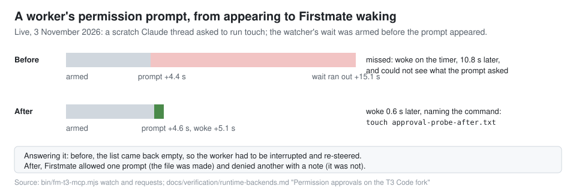

The question:

> I noticed that when a crewmate has an approval pending first mate does not pick up the approval instantly. Can you check if the approval handoff is the same as the done handoff where it's instant like pub sub style or is it running on some sort of poll timer?

It was a timer.
A worker's status line ends the watcher's wait at once, but a permission prompt was only looked for when each wait began, so one that appeared mid-wait sat until the wait ran out, up to 15 seconds.
And once seen, Firstmate could not answer it: the T3 Code fork lists approvals in a field Firstmate never read, so Firstmate saw "one approval pending" with nothing to approve, and had to interrupt the worker and steer it instead.

Of the three fixes offered, his answer:

> Yeah, you should do all three if you believe the third one is the right move. At least do one two. But do three as well if you believe it.

The third, telling workers to avoid commands that trigger prompts, was done separately in this home's own brief additions.
This entry is the first two:

- Firstmate now reads the fork's approval list correctly, so it names each pending prompt with what it asks for, and allows or denies it directly.
- The watcher's wait now also checks for new questions and prompts about once a second, so one that appears mid-wait wakes Firstmate within about a second, the same way as before, once per prompt.

The choice made: this is a fast check, not true push.
T3 gives Firstmate's connection no signal when a prompt opens: its thread wait ends only when a run finishes, and its live event stream refuses this kind of sign-in.
A once-a-second read of a local server is cheap, and the old timer stays as the backstop.
True push would need a change to the fork, letting its thread wait also end when a prompt opens; that is left as a follow-up rather than done here.

What is still not instant: while Firstmate is in the middle of its own turn, nothing waits on workers at all, so a prompt raised then is picked up when that turn ends, as before.

The evidence is live, against the fork on 3 November 2026, with a scratch Claude thread told to run `touch` in a scratch project: before the fix the wait missed the prompt and ran out 10.8 seconds after it appeared, and the list came back empty; after, the wait woke 0.6 seconds after the prompt, naming `touch approval-probe-after.txt`, one prompt was allowed and its file appeared, and another was denied with a note and its file never did.
The T3 client and T3 backend suites cover the new check and the corrected list.

## 14. Approvals reach Firstmate by push, and idle workers cost the server nothing (3 November 2026)

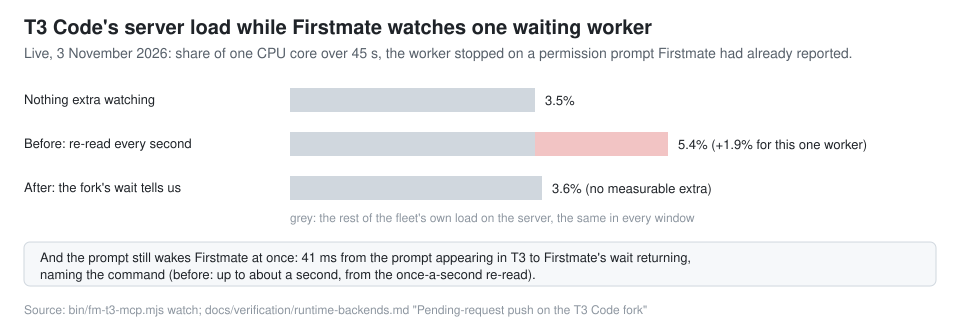

His word on it:

> Earlier today we were discussing this and let's go with your recommendation here.

The recommendation was true push.
Entry 13 made a worker's permission prompt wake Firstmate within about a second by re-reading every watched worker's pending requests once a second.
Each of those reads cost T3 Code's server real work, so every watched worker kept part of a core busy, more with each worker, even while they all sat idle.
The fork's half landed first: its thread wait, which Firstmate already holds open on each running worker, can now also end the moment a question or prompt appears, and hands back what is pending.

What was built, in Firstmate:

- Firstmate's wait asks the fork to end on a new question or prompt, telling it which ones Firstmate has already reported, so a reported prompt never wakes it twice.
- When the fork ends the wait on one, Firstmate reports it from what the fork handed back, with no second read.
- The once-a-second re-read is gone. The 15-second check stays as the backstop.

The choice made: no fallback for an older T3.
Firstmate already requires the T3 Code fork, so on a T3 without the new wait it simply sees a new prompt at its next 15-second check, and `status` warns rather than quietly keeping the old loop.
One honest gap: a worker that is idle when the wait begins and starts a new turn during it is first seen at the next check, within 15 seconds, because there is no running turn to wait on yet.

The evidence is live, against the installed fork on 3 November 2026, with a throwaway Claude thread in a scratch project told to run `touch` under a rule that makes it ask: the prompt woke Firstmate 41 ms after it appeared, naming the command; and with the worker sitting on an already-reported prompt, the server's load was 3.6% of a core with the new wait against 5.4% with the old re-read and 3.5% with nothing extra watching.
The scratch threads and project were deleted afterwards.
The T3 client and T3 backend suites cover the push, the already-known prompt, run end, the time limit, and an older T3 without it.

## 15. The fast handoff now comes from upstream (4 November 2026)

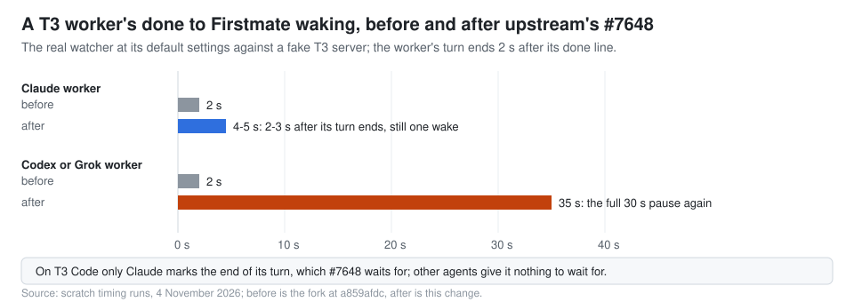

His words, on hearing upstream was already fixing the same pause:

> Oh okay. I mean if upstream's already fixing it then yeah we don't need to worry about that. Um if it's simpler than ours, in that it's more elegant, we should try to adopt theirs and then fit our pieces around that. The standing rule would be to maintain minimum but necessary deviation from And maybe also add in the cause that's like especially if it's upstream is more elegant. But even if it's not more elegant, I should be notified about that and I can make a decision.

Upstream's open pull request [#7648](https://github.com/kunchenguid/firstmate/pull/7648) fixes the 30-second pause from entry 1 in 4 files instead of 21.
The pause becomes a limit rather than a fixed wait: it ends as soon as the worker's turn-end arrives after its status line, so the pair still costs one wake.

What changed in his fork:

- #7648 is merged in as its author wrote it, ahead of upstream merging it; the next upstream sync reconciles it.
- Entry 1's own machinery is gone: the record of which turn wrote a status, the proof checks, the report of a turn that ends badly after `done`, the state-folder watch, and cleanup's wait for a running turn.
  The watcher's difference from upstream went from about 490 added lines to about 55.
- Kept, because #7648 does not touch them: a finished worker's `done` still goes straight to Firstmate instead of through the supervision host's extra turn, and a T3 worker's question or approval still wakes Firstmate at once.

The part he asked to hear about: upstream's version is not better for every worker.
#7648 waits for the worker's turn-end marker, and on T3 Code only Claude writes one.
A Claude worker now reaches Firstmate 2-3 seconds after its turn ends, a little slower than before.
A Codex or Grok worker, this home's computer-use and probe lanes, now waits out the full 30-second pause again.
The option, if he wants it: a small T3-only addition that marks a worker's turn-end when Firstmate's T3 wait sees its run finish, which would bring those workers back to a few seconds for most finishes.

The evidence is the watcher, signal-grace, T3 backend, T3 client, supervision host, supervision events, turn-end, away daemon, branch dispatcher, and cleanup suites, all passing, including the poll-only-home case that the fork's own state-folder watch had been failing.
The timings come from scratch runs of the real watcher at its default settings against the fake T3 server, with the worker's turn ending 2 seconds after its `done`: before, both workers woke Firstmate in 2 seconds; after, a Claude worker took 4-5 seconds and a Codex worker 35.

## 16. Waiting for captain, on the card (4 November 2026)

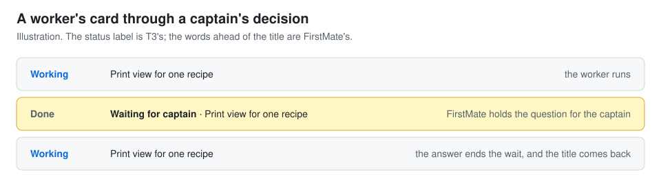

An illustration of the card, not a screenshot: a browser pointed at the live T3 needs a pairing token, and minting one for a picture was not worth it.

His words:

> I imagine how it works is when a worker finishes, it will say done, and then first mate picks it up immediately, and then the done will either either disappear and turn into working again if first mate like tell it to risk to to act or um it can also say waiting for captain, which is where first mate has determined that okay, only a cap a captain is needed to unblock this.

> Yep, perfect. Okay. We're aligned. We're aligned on waiting for captain as well

What was built, in Firstmate alone, with no change to the T3 Code fork:

- When a captain hold is open on a live T3 worker, its thread title reads `Waiting for captain · <title>`. It goes when the hold ends, and when the worker is cleaned up.
- The title is rewritten from the thread's live title, so nothing keeps a copy that could go stale.
- A rename that fails, or meets a stopped T3, never fails the hold or the answer. A small record stays until the title is proven, and the watcher repairs it within about a minute.

The choices made:

- **The trigger is the captain hold, and only that.** The hold can be on the worker's own task or on a task with `--origin` naming the worker. A worker's `needs-decision` line does not count, since Firstmate settles most of those itself. A question a live worker is parked on is covered by Firstmate holding it as it escalates, which is already the rule, so there is no new status word or worker protocol.
- **A hold with no running worker changes nothing,** because there is no card to label.
- **Cleanup restores the title even while the hold stays open,** so an archived thread reads as the work.

The half that could not be done here: Done still clears only when the card is opened.
T3 clears it through a visit, and the visit command is only reachable from T3's own client: no tool Firstmate can call sends it, `t3_thread_organize` offers `mark_unread` and no opposite, and T3 refuses a Firstmate sign-in anywhere but its tool endpoint.
So a waiting card can read Done beside the new title until it is opened.
It needs one small fork change: a `mark_read` action on `t3_thread_organize` that sends the visit command.
With that, Firstmate marks the thread seen when it reads a worker's report.

The evidence is two throwaway threads on the live T3, a parent and a crew card, renamed through the same tool Firstmate calls.
The label landed mid-run and stayed when the run ended, the thread still read as crew of the same parent, and the title restored and relabelled cleanly on the finished thread.
A rename on an archived thread also works, which is why an archived thread always loses the label.
Firstmate's own rename command ran only against the fake T3 server, with the hold, answer, cleanup, watcher, and capability suites, because this worker had no sign-in for the live one.

## 17. Every check-in opens with the high level objectives (5 November 2026)

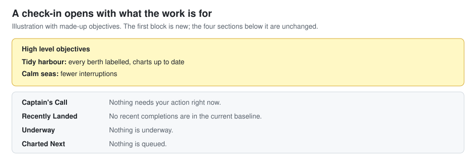

The ask:

> I also want a Hoi or Bearings to announce our like high level objectives which I think you called it directions, although I'm not even sure why you called it directions. But yeah, I'm just gonna refer to it as our high level objectives. Um, which is kind of a good thing to just be reminded of anytime we're getting our bearings or any time we're checking in on what's happening.

What was built:

- One small reader, `bin/fm-objectives.sh`, returns the bullets under `## High level objectives` in this home's private `data/OBJECTIVES.md`. A missing file or section means none, and no error.
- Bearings gets them as an `objectives` field and opens every digest and file report with one short line each, above the four sections.
- A normal `/ahoy` recap opens with the same block. It may run that one reader and still nothing else. When `/ahoy` falls back to Bearings, the objectives arrive through Bearings, so they are not printed twice.

The choices made:

- **The block is not a fifth section.** The four sections always render, and an empty one says so. A home with no objectives has nothing to report, so the block is simply left out.
- **The chat shortens, the reader does not.** The field carries each objective's full text, and the chat writes the short line.
- **The Bearings board is unchanged.** The chat digest beside it carries the objectives.
- **One name throughout.** Tracked text says "high level objectives", and the captain approved renaming the private file to match, so it is now `data/OBJECTIVES.md`.

The evidence is the Bearings snapshot suite, with new cases for objectives present, section missing, and file missing, all using made-up objectives. The present case also plants lookalike bullets above and below the section, because the real file has one above it.
The skill wording itself has no automated test, so the first real `/bearings` and `/ahoy` after landing are its proof.

## 18. Priorities, objectives, and ideas in one place (5 November 2026)

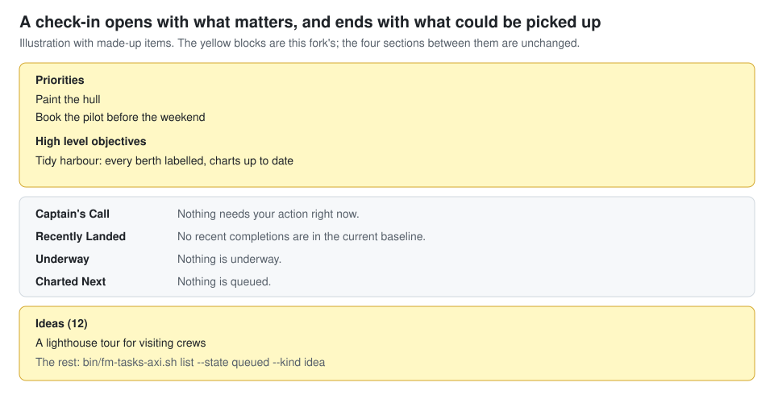

The ask:

> honestly I would actually like a bit more of just um high level objectives.md and priorities.md and then backlog.md if we need one.

And on open threads:

> I do think open threads functions in every way like your backlog. It's just an idea that hasn't gotten any work done about it yet because these days I still ask you it's like hey what's open right now and you give everything from your backlog but you really should also r tell me about the open threads as well right so then I can like see if I want to move on them. So I personally like to merge backlog with open threads.

What was built:

- `bin/fm-objectives.sh` now reads two plain bullet lists, `data/priorities.md` and `data/high-level-objectives.md`. A missing file is an empty list.
- Bearings and `/ahoy` open with the priorities and then the high level objectives.
- The backlog has an `idea` kind. An idea is never dispatched, never counts as ready, and never reads as waiting on the captain.
- Bearings shows ideas after Charted Next: a count, the newest few, and the command that lists them all.
- Changing an idea's kind turns it into work.

The choices made:

- **One state word does most of the work.** The backlog row reader reports a queued idea's state as `idea`, so spawn and every other `queued` check refuse it without each learning about ideas.
- **`tasks-axi` itself is unchanged.** It has no notion of an idea, so its `ready` output is filtered on the way out, in the wrapper and in the startup digest.
- **A captain hold on an idea is refused.** An idea with a stray hold from before this change still reads as an idea, not a decision.
- **Rows are `{text}`.** The old `**Name:** text` shape is gone, because the files are plain bullets now.

The evidence is the suites for the snapshot, the fleet view, the wrapper, session start, captain holds, and dispatch, with new cases for each refusal and for promoting an idea to work.
The skill wording has no automated test, so the first real `/bearings` and `/ahoy` after landing are its proof.
The private files and the migration of open threads into the backlog are left to Firstmate, with the captain's look.

## 19. The card's status spot, and Testing (5 November 2026)

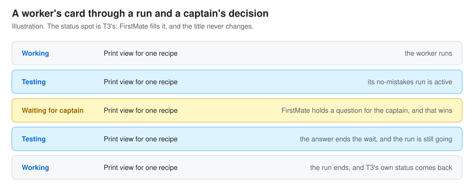

An illustration of the card, not a screenshot: the T3 Code with the status spot is staged, not yet installed, so this is proven against the fake T3 server.

His words:

> Replace fm-t3-captain-label.sh's title prefix with the new status label, and show Testing while a worker is in a no-mistakes run.

What was built, in Firstmate alone, on the T3 fork's new crew card status:

- `Waiting for captain` now sits in the card's status spot, and Firstmate no longer renames a thread at all.
- A ship's card reads `Testing` while its no-mistakes run is active, and clears when the run ends.
- Waiting for captain wins when both apply, and Testing comes back when the wait ends if the run is still going.
- Because the label takes the status spot, a waiting card no longer reads Done beside it, which closes the half left open in section 16.

The choices made:

- **`bin/fm-crew-state.sh` decides whether a run is active.** Its reading of working or parked at a gate is the answer, so no second copy of its run attribution exists. A run it cannot read leaves the card as it is.
- **A PR with green checks is not Testing.** The run may still be watching the PR, but `bin/fm-crew-state.sh` reads that as done, so the card clears.
- **Only the watcher's pass looks for new runs.** A hold or an answer updates the workers already labelled, so it never waits on a run read for every worker. Testing can therefore lag a run's start or end by about a minute.
- **An older T3 is told nothing it would refuse.** Its tool list shows it has no label, so holds and cleanup carry on, and the record stays so the card catches up after an update.
- **The record is the worker's folder.** An empty folder means the card may carry a label, so a run needs no new kind of record.

The evidence is the label and T3 helper suites against the fake T3 server, with new cases for Testing, the order of the two labels, a scout, an older T3, and the watcher finding a run on its own.

## 20. Refresh context, FirstMate's half (5 November 2026)

His words:

> I want my experience on the front end to stay the same it's as if I've gotten a new first mate thread but in the back end it essentially swaps out the thread and starts a new one.

> when I click this button, it essentially dumps the old thread or it stows, does whatever stowing it needs. It dumps the old thread and then creates a new one and runs bearings on it. And the front end experience for me stays exactly the same.

And then, changing that last part:

> Actually for the first mate refresh button, don't run bearings on new first mate thread.

The T3 side landed first. What was built here:

- `Context refreshed.`, T3's plain opening message for the new session, is operational and not the captain speaking. The session starts and takes the helm, replies in one short line, and runs no Bearings.
- `/stow` from T3 finishes without asking anything. What it would have asked becomes a held decision, so the next session's digest and Bearings carry it.
- `tests/fm-session-swap.test.sh` runs the swap with real processes. No lock or watcher code had to change: the proof found the handover already works.

The choices made:

- **The classifier owns the opening message.** `bin/fm-operational-input.sh classify` recognizes the exact text, so the dialog mirror, the Pi branch, and Calm all treat it as machinery with no second rule. Captain words that happen to be exactly `Context refreshed.` read the same way.
- **`/ahoy` stays as it was.** Its only change is that this message is not a captain boundary, so a first real `/ahoy` after a refresh still gets Bearings, because the captain asked for it.
- **Every `/stow` on T3 is treated as the button's.** The message looks the same whoever sent it, so a `/stow` typed in T3 also asks nothing, and its questions wait in held decisions.
- **The swap test runs both fates of the Stop hook.** Whether Claude kills a running hook when it is signalled is its own choice, so the hook dying with the session and the hook living on as an orphan are both proven.

The evidence is that suite, seven cases: the lock passing over, a session beside a live holder staying read-only, the dead session's Stop hook changing nothing, and a wake queued during the swap reaching the new session with one watcher left, on the supervision host and on the plain arm.

Real Claude ran the swap too, in a throwaway home on T3's launch flags, with no way to reach the real one. It exited about half a second after SIGTERM and took its Stop hook and watcher with it, and the next session took the lock and kept the thread id. `Context refreshed.` ran no Bearings in five sessions out of five, four on Haiku and one on Opus, and a real `/ahoy` after it still gave Bearings. An undecided question before `/stow` became a held decision, and the next session's Bearings listed it under Captain's Call.

The real home's own lock has not been exercised, by design. The first press of the button after this lands is that proof.

## 21. Every fork feature in both documents (6 November 2026)

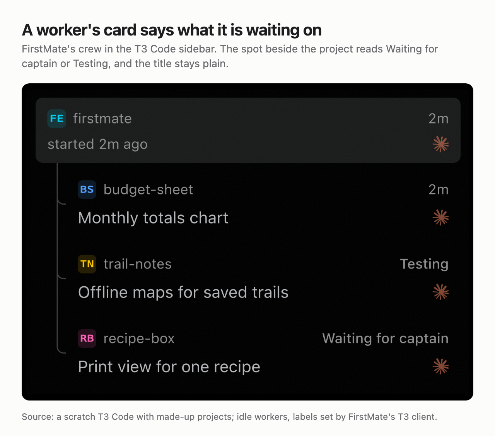

The ask:

> Check that the fork has all of its features, meaning all of its deviations from upstream, documented both in the short description in the root README and in the full account with screenshots in `FORK.md`.

The check read the whole diff against upstream, not just commit subjects.
What changed:

- `FORK.md` gained four entries it was missing: crew lineage, the live thread record, the credential guard, and the telemetry warning.
- Existing entries were corrected or filled in: Muse and Antigravity were missing, OpenCode's refusal now states the verified reason, and the restart and approval entries now say what the code does beside them.
- The README's fork section is now one short line per feature, each linking to its `FORK.md` entry, with every feature present.

The choices made:

- **The card picture is now a real screenshot.** The card status was an illustration while the T3 Code with the status spot was only staged; it is installed now, so a throwaway T3 with made-up projects took its place. The labels were set by FirstMate's T3 client on idle threads.
- **The approval picture reuses measured numbers.** 10.8 s and 41 ms are the two live probes of 3 November, one each.
- **Crew lineage, the thread record, the credential guard, and telemetry get no picture.** The crew already shows in two pictures, and the other three have nothing to show.
- **The Bearings picture moved to `docs/media/fork/`**, so it lives once, and this devlog links to it.

## 22. Refresh context gives way to /clear (6 November 2026)

His words:

> I just tried out the slash clear and it works really well. Um so I think we can essentially abandon our first mate refresh button because you know we can always just run stow and run clear ourselves and that seems fine and and I sometimes even prefer to not run STO because I can save tokens that way

Upstream T3 Code now starts a fresh session on the same thread with `/clear`, which is what the Refresh context button already did underneath.
The T3 Code fork is dropping the button, so FirstMate drops its half of entry 20:

- `Context refreshed.` is an ordinary message again: no special kind in `bin/fm-operational-input.sh` or the Calm mod, and no rule for it in `AGENTS.md` or `/ahoy`.
- `/stow` behaves the same on T3 as anywhere else, so it can ask questions again.
- The Refresh sections in `FORK.md`, the README and the T3 Code backend doc are gone.

The choices made:

- **The swap test stays, renamed for `/clear`.**
  `/clear` ends the old Claude process and starts a new one exactly as the button did, so the lock passing over, the dead session's Stop hook changing nothing and supervision re-arming still need proving.
  It is now `tests/fm-t3-clear-session.test.sh`, and the backend doc describes `/clear` in place of the button.
- **The dated real-Claude check stays, trimmed to the process facts.**
  The parts about `Context refreshed.` and the button's `/stow` backed nothing any more.
- **One thing to keep in the T3 Code fork.**
  Its Claude adapter waits for the old process to exit before the new session opens; upstream does not, and without that wait the new FirstMate session can come up read-only.

## 23. Decisions as their own threads, FirstMate's half (6 November 2026)

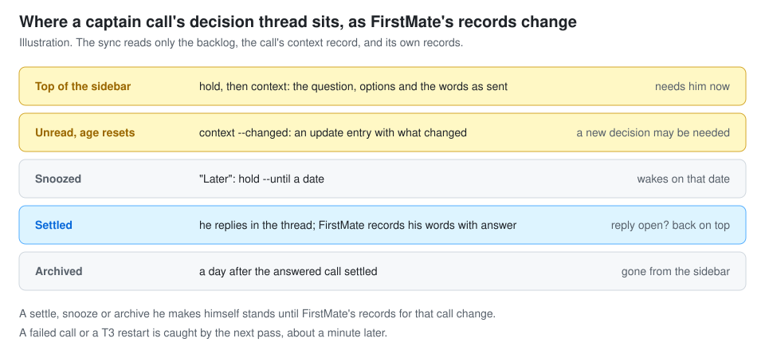

The ask:

> show the needs me um items with all of its original context in T3 code ... in a running chat sometimes it gets lost, like what needs me, and when I get reminded of what needs me, I'm often only shown the the summary snippet, but not the original context that it came with it.

> it's also yeah a place that first mate can always check like what still needs me um and it doesn't have to mention it again. It can just sort of check if all of that is still up to date. If it is, assume the captain's looking at it.

Of the mocked-up directions he chose the one where each decision is its own thread:

> everything at the top level needs my attention. Everything one layer deep, such as like the first mates workers, they don't need my attention.

The T3 Code fork draws the threads; this is FirstMate's half, which keeps them true:

- **The original words are kept.** Before FirstMate raises a call in chat it saves the same text, the question, the options, and any report or picture with `bin/fm-captain-hold.sh context`. Telling him something new about a call adds an update with a one-line "what changed".
- **A level-triggered sync**, `bin/fm-t3-needs-me.sh`, runs after every hold, answer, and context, and once a minute from the watcher. It reads only structured records and gives each open call one thread: on top while it is live, snoozed until its date for Later, settled when answered, then archived a day later. An update marks the thread unread, so its age goes back to the time of the update.
- **His reply is an ordinary message.** T3 sends it into FirstMate's chat with a `needs-me-task:` line naming the call, and FirstMate records his words exactly as for any answer.
- **Chat stops repeating.** While the threads match the records, Captain's Call gives the count and names only decisions that are new or changed since FirstMate last named them.

The choices made:

- **His own moves stand.** If he settles, snoozes, or archives a decision thread himself (replying settles it), the sync leaves it so until FirstMate's records for that call change. A reply that leaves the call open gets an update, which brings it back to the top.
- **Long-waiting and blocked calls go to Settled, not the top.** Bearings already keeps those out of Captain's Call; they stay findable and come back up when they turn live again. (Long-waiting calls were moved back to the top in entry 24.)
- **One T3 call per pass.** The whole pass runs in one session, and creating a thread is retried under the same request id, so a lost reply never makes a second thread.
- **Secondmate homes make none.** Their calls already reach him through the main FirstMate.

## 24. A call that has waited long stays at the top (6 November 2026)

The rule behind the decision threads, in his words:

> it should be at the same level as first mate ... everything at the top level needs my attention. Everything one layer deep, such as like the first mates workers, they don't need my attention.

Entry 23 sent calls that had waited a long time to Settled, to match Bearings' Captain's Call. That was wrong under this rule: a call that has waited a long time still waits on him.

- **Aged calls are active threads now.** `bin/fm-t3-needs-me.sh` treats a call past the aging threshold exactly like a live one: on top of the sidebar, counted in the waiting total, and named in chat while new or changed.
- **Blocked calls stay in Settled.** They wait on other work, not on him, and come back up when they unblock.
- **Bearings is unchanged.** Its Captain's Call still lists only live calls and shows long-waiting ones as gates; the two views now differ on purpose.
- **Threads settled under the old rule come back up** on the next pass, since the wanted state for those calls changed.

## 25. A call gets its day when it becomes actionable (7 November 2026)

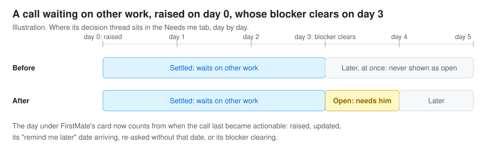

Since 7 November a decision thread moves to the Snoozed shelf (Later in the Needs me tab) a day after it was raised or last updated, so the open list shows only the last day's calls.
The nightly review of that change kept finding gaps about when a call's day starts.
The worst: a call waiting on other work that became actionable more than a day after it was raised went straight to Later, so it never showed as needing him.
Of the two options FirstMate put to him, he took its lean:

> Go with ur call for 2-5

- **One rule.** A call is open under FirstMate's card for a day from when it last became actionable, then goes to Later.
  It becomes actionable when it is raised, updated with `context --changed`, or turns live from deferred or blocked: its `--until` date arrives, it is re-held without that date, or its blocker clears.
- **One small record.** Each call's sync record in `bin/fm-t3-needs-me.sh` now keeps `activeSince`: empty while the call is deferred or blocked, and stamped by the first pass that sees it actionable again.
  This replaces the special case for dated holds, which counted from the `--until` date.
- **His own moves still stand.** Moving a call to Later never overrides a snooze, settle, or archive he made himself.
- **Records from before this change** have no stamp, so their day counts from the raise and updates alone, and nothing jumps back to the top on upgrade.

The evidence is `tests/fm-t3-needs-me.test.sh`, against the fake T3 server: a due dated hold, a deferred call re-asked early, and a call whose blocker clears four days after it was raised are each open for a day, then shelved.
The last two cases fail on the code before this change.

## 26. The Bridge opens with the objectives (7 November 2026)

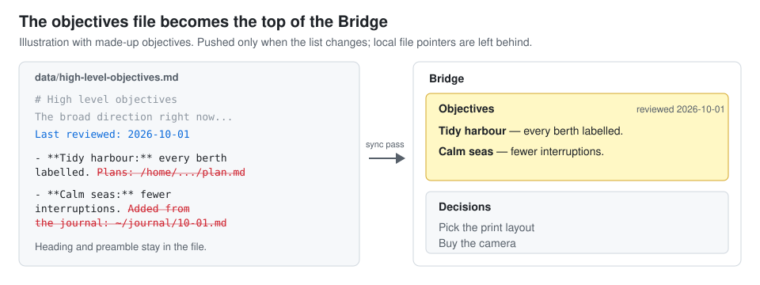

The ask, while looking at the Needs me tab:

> Also, I'm considering turning Needs Me into Like a bit of a Bit of like a first maid's I don't know like overview panel. So I don't know what to name the the the tab but I want to start putting high level objectives in here as well. Just so I can constantly be reminded what my objectives are.

He then picked the name Bridge.
The T3 Code fork draws the tab and took a new tool, `t3_objectives_set`; this is FirstMate's half, which keeps the list there true:

- **The objectives file stays the source.** The same sync that keeps the decision threads true, `bin/fm-t3-needs-me.sh`, now also builds the Bridge's list from `data/high-level-objectives.md` on every pass and pushes it only when it changed since the last push T3 accepted.
- **Only the bullets travel.** Each objective keeps its bold name and its text; the heading and preamble stay in the file, and the `Last reviewed` day rides beside the list, where the Bridge shows it.
- **Local file pointers are left behind.** A trailing sentence that only points at a file on this machine, such as where the decisions so far are kept, would mean nothing on the Bridge, so it is dropped.
- **Nothing is ever dropped to fit.** Past T3's 8,192-character limit every objective stays and each long text is cut, ending in an ellipsis, and the sync says so.
- **No file clears the Bridge once.** An absent file, or one with no bullets, clears the list a single time rather than on every pass.
- **A failed push never holds the decisions back.** It is reported and tried again on the next pass, backing off after three failures in a row the way a decision does, and a T3 without the tool is skipped quietly.

The choices made:

- **The name and text are joined with a dash**, as the fork's README shows, rather than the colon the file uses.
- **A pointer goes with its whole sentence.** "Added from the 5 November journal, which holds the full details: (path)" goes entirely, since without the path the sentence points at nothing; a sentence with no path, such as "(same file)", stays as written.

The evidence is the decision sync suite against the fake T3 server, with new cases for the payload's shape on made-up objectives, the 8,192-character limit, a push only when the list changes, a failed and an unproven push retried, the clear, the back-off, and an older T3.
The first push to the live T3 was left to FirstMate after landing.

## 27. "Restart when no worker is running" is a hook in the watcher (7 November 2026)

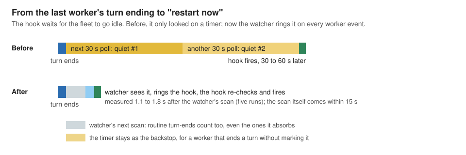

The ask was to restart T3 Code "the next time no worker is running", as a standing kind of instruction:

> going forward, I might give you such commands like restart next whenever available or okay to restart when next available. Such commands should essentially make you watch each worker status and when active workers reaches zero you run the restart.
>
> (7 November 2026)

He noted that such instructions had not been followed well before.
FirstMate first armed a watch that polled every 30 seconds and restarted after two quiet polls in a row, and explained why checking on each worker's reply would miss the moment: the watcher quietly absorbs routine turn-ends, so FirstMate never sees them.
His answer:

> Oh why don't you just build it into the watcher then? Like a watcher seems like the perfect place. ... It also sees if there's an outstanding hook ... and if there is you know run the hook and then gives it to first mate.

What was built:

- **The watcher rings a doorbell on every worker event.** Each time it sees a worker's status write or turn-end, it rings once as soon as it notices, and again after its usual linger, before it decides whether to wake FirstMate or absorb the event. Routine turn-ends it absorbs ring it too.
- **A watch can listen for the doorbell.** `bin/fm-procevent-when.sh arm --on-worker-event` makes a condition->action watch re-check at once on a ring, with its interval kept as the backstop. Everything the watch already guaranteed stays: the action is trust-bound, fires at most once, and FirstMate gets the outcome as an ordinary wake.
- **A generic "is anyone mid-turn" check.** `bin/fm-fleet-idle.sh` exits 0 only when no worker of this home is inside a turn or still running its own work. A worker whose state cannot be read counts as busy, so an unreadable worker never lets a restart through. FirstMate's own session is not a worker.

The choices made:

- **The watcher only rings; the watch decides.** The watcher never runs the condition or the action itself, so a slow check can never hold up supervision, and the existing trust and fire-once rules apply unchanged. Building the check into the watcher directly would have meant a second copy of those rules.
- **The check reads each worker's live session and its running processes, not its status log.** That keeps it cheap enough to run on every event, and it means a worker sitting in a long command counts as busy even if it last wrote `paused:`.
- **A worker's own background work counts too.** While this change was being built, the interim 30 second watch restarted T3 Code while its worker sat in a `paused:` wait on its own background test run, and the restart cut that run. So a worker whose session is idle still counts while any process it started is working inside its worktree, such as a test run or a dev server. Its agent, the agent's process group, and the agent's parent shell are left out, so a paused wait on something outside, like captain feedback, still reads idle.
- **A worker whose agent does not mark turn ends**, such as a non-Claude worker on T3 Code, is caught by the interval instead.
- **The restart itself stays private** to this home; only the general "do X when the fleet goes idle" pattern is shared.

The evidence is the regression suites, plus a timing run with the watcher running, absorbing, and scanning once a second: a routine turn-end fired a watch with a 10 minute interval 1.1 to 1.8 seconds later, in five runs at the watcher's default 30 second linger.
In a real home the watcher notices a turn-end on its next scan, which comes within 15 seconds by default.
Tests also show a busy worker holding the hook back, an idle worker's background job holding it back while its agent does not, the hook firing once and never again, and the interval still firing it with no event at all.

## 28. Open calls stay at the top until answered (8 November 2026)

A comparison of this fork with upstream FirstMate found that entry 25's rule hid calls: a decision thread stayed under FirstMate's card for a day after it last became actionable, then moved to the Snoozed shelf (Later) with no return date.
There it stopped counting in the waiting total while the call was still open, which goes against upstream's intent that silence and batching never hide a decision.
His answer:

> Okay, um let's not snooze it.

- **No more day at the top.** `bin/fm-t3-needs-me.sh` keeps a live or long-waiting call as an active thread under FirstMate's card, counted as waiting, until it is answered or closed, however long it waits.
- **The bookkeeping went with it.** The one-day timer, the `activeSince` stamp in each call's sync record, and the T3 helper's "shelve" flag existed only for that rule, so all three are gone.
- **Everything else is unchanged.** A call deferred with `--until` still sits snoozed until its date, a blocked call still waits in Settled, his own snooze, settle, or archive still stands, and chat still names only new or changed decisions.
- **Calls the old rule shelved come back** on the next pass, since the wanted state for those calls changed.

The evidence is `tests/fm-t3-needs-me.test.sh`, against the fake T3 server: a call raised a week ago, a dated hold a day after its date, a deferred call re-asked early, and a call whose blocker cleared all stay under FirstMate's card, and a thread the old rule left on the shelf comes back.

## 29. Chat lists every decision again; the threads are an extra track (8 November 2026)

> I don't think [upstream's] version was working very well because I was only ever getting a one-liner, like a summary about the decision, when it gets restated. And my thinking is we can keep that one-liner question. We can essentially keep um the upstream intention, but we create an additional track to track the decisions and its like evolution in full detail. So I'm thinking it's an additional track rather than overriding the default
>
> — 8 November 2026

Entry 23 made chat stop repeating: while the decision threads matched the records, Captain's Call gave a count and named only new or changed decisions.
That overrode upstream's listing instead of adding to it, so this round puts the listing back and keeps the threads beside it.

- **Captain's Call lists every open decision again**, one short line each, exactly as upstream does, whether or not T3 is in sync.
- **The decision threads are unchanged.** Each call still has its own thread carrying its full context and every update, created, snoozed, settled, and archived as before.
- **The count machinery is gone.** `bin/fm-t3-needs-me.sh status` and `mentioned`, the record of what chat last named, and the in-sync mark existed only for the count rule, and nothing else read them.

The choices made:

- **The text matches upstream again** in `AGENTS.md` section 9 and in Bearings' Captain's Call, so later upstream changes there merge cleanly.
- **Recording a call's context before raising it stays**, because the threads show those words; the `captain-hold-lifecycle` skill's own trigger already covers when to do it.

The evidence is `tests/fm-t3-needs-me.test.sh`, which still proves every thread placement against the fake T3 server, now by reading the threads directly.

## 30. Review boards pass each message on at once (8 November 2026)

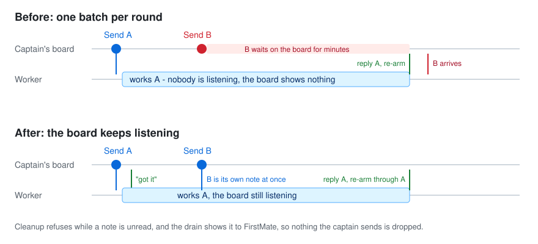

> the messaging between the lavish board and first mate is too janky ... I would like it if we can actually understand why it's so delayed, like the responses from lavish to the workers... It's definitely not immediate.
>
> — 8 November 2026

Two things were behind it.
Each board round was one batch: after a Send, the board stopped listening until the worker finished the whole round and handed its reply back, so anything sent meanwhile waited on the board with no sign it had been seen.
And a note could be lost outright: a layout scout reported its decision, the captain answered on its board a minute later ("So B is good. I like B."), and FirstMate, which never sees a worker's board notes, completed the scout's decision and cleaned the scout up with the note unread.

The fix he asked for:

> Yeah, if that chat actually functioned more like a back and forth and any new messages I send it, it's sent to the worker as a steer. That would be ideal.

What was built:

- **The board keeps listening.** Once a round's note is in the worker's steering inbox, the same listener waits for the next Send, so every message reaches the worker as its own note the moment it is sent.
- **The worker says "got it" at once.** Its instructions now ask for a one-line reply on the board as soon as it reads a note, before working it, and its full reply when the round is done.
- **A reply answers only its own rounds.** The re-arm takes `--through <round>`, so a note that arrived while the worker was busy stays open until it is answered.
- **Nothing is dropped at cleanup.** Cleanup refuses, even when forced, while a worker's board holds a note nobody has read, the wake drain lists such notes for FirstMate, and completing a decision names them.

The choices made:

- **It needs a Lavish that posts replies on its own** (0.1.80 and later); an older one keeps the one-batch rounds, because its reply can only ride the next listener.
- **The listener stops if a note cannot reach the worker**, so a failed delivery never lets the board take in more messages nobody can read.
- **How fast a busy worker sees a note depends on its runtime.** Measured on this Mac, a T3 Code worker gets it right after its current tool call; tmux was not installed and Herdr was not driven, so terminal workers are not measured.
- **Lavish marks notes Done on any reply**, the "got it" included, so that reply is what tells the captain the worker has the note.

The evidence is the new `tests/fm-procevent-lavish-live-steer.test.sh`, which replays the sequence against a stand-in Lavish, plus new cleanup, decision-completion, and drain cases.
A probe against a private Lavish 0.1.96 server confirmed that a reply posts while the listener is live without ending it, and that a note sent mid-round comes back on that listener at once.

## 31. Rebased work lands when it is the same work (8 November 2026)

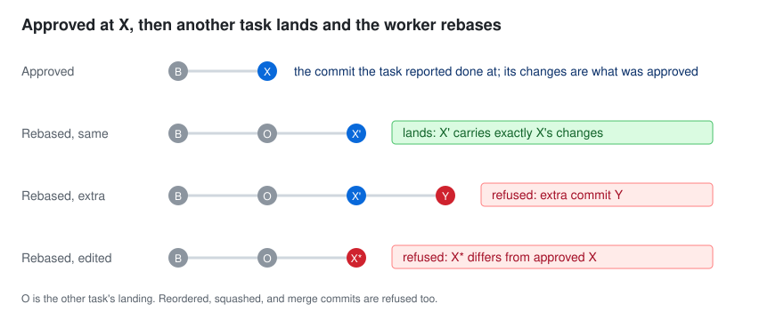

On the evening of 8 November three `local-only` tasks on one project were refused at landing one after another and had to be landed through extra record-keeping tasks.

> Landing tool fix we wanna know upstream intention - why only issue for us
>
> — 8 November 2026

Upstream's landing records the commit a task reported done at and lands only that commit ([#7782](https://github.com/kunchenguid/firstmate/issues/7782)).
That stops a worker that was steered after its approval from slipping unfinished commits into the landing.
It bites here because several projects run `local-only` with yolo and many workers at once: each landing moves main, the next worker rebases as its instructions say, and its rebased commit is no longer the recorded one, so the approval had to be given again for unchanged work.

> Ok landing tool fix is go
>
> — 8 November 2026

What was built:

- **A rebased branch lands when it is the same work.** Its commits must match the approved ones one for one by exact content, in the same order, and it must still fast-forward main.
- **Anything else is still refused, and the refusal says why.** An extra, edited, reordered, squashed, or merge commit is refused with the commits that differ named.
- **The worker's second "done" counts too.** A done report naming the rebased commit is accepted by the same check, so the task does not look blocked before landing.

The choices made:

- **Exact content, whitespace included.** Git's usual patch comparison ignores whitespace, which would let an indentation-only edit pass as unchanged, so the check compares patches verbatim, binary files included.
- **Commit messages may differ.** The approval is about what changes, so rewording a message keeps the work the same.
- **The approval stays where it was given.** The task keeps the commit it first reported as its approved one, and the landing records the rebased commit it actually landed.
- **The same rule with or without yolo.** A rebase that carries exactly the approved changes is the approved work, so it needs no new approval either way.

The evidence is two new cases in `tests/fm-merge-local.test.sh`: a rebased, reworded branch lands and is recorded, and extra, amended, whitespace-only, merge, reordered, and squashed variants are each refused with the differing commits named.
Swapping the verbatim comparison for Git's whitespace-blind one makes the whitespace case fail, which shows the test guards it.

## 32. The card says Working as soon as the worker picks up a reply (9 November 2026)

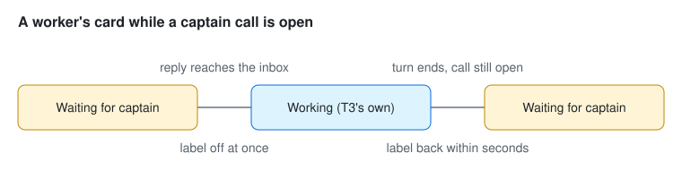

With review-board replies reaching workers in seconds, one gap was left on the T3 card:

> Now the only thing that's still to be refined is when I reply I can see that the agent's working, but I don't immediately get an update to the T3 code thread. Like T3 code thread will continue to say waiting for captain until you action it or something?
>
> — 9 November 2026

The card read `Waiting for captain` for as long as the captain hold was open, and the hold stays open until firstmate records the answer, so the card kept waiting while the worker was visibly at work on the reply.

What was built:

- **The wait shows only between turns.** While the worker works, the label comes off and T3 shows its own Working state. "Works" means T3 reads the thread busy, or a message is still unread in the worker's steering inbox, which covers the moment the reply lands before T3 reports the turn.
- **It comes back when the turn ends with the call still open**, so a worker that returns still needing the captain shows it again.
- **No new polling.** Delivering a message to a T3 worker re-syncs the card at once. The watcher's existing wait on T3 now reports which runs it saw active, so a run that ended, during a wait or between two, makes the card sync due straight away with no extra server call.

The choices made:

- **The hold itself is untouched.** The label is display only; the call stays open and is answered exactly as before.
- **One sync at a time.** The delivery and the watcher can now sync at the same moment, so a sync that read the worker before a newer event could have written its card last. Syncs now run one at a time, and one that arrives during another asks it to run again.
- **A turn that cannot be read leaves the card alone**, as an unreadable hold or run already did.
- **`Testing` keeps its meaning.** A ship mid-turn through an open call with an active run shows `Testing`, and the wait returns on top when the turn ends.

The evidence is four new cases in `tests/fm-t3-captain-label.test.sh`: the wait follows the turn (idle shows it, busy or an unread message hides it, the turn's end brings it back, an unreadable turn changes nothing); a delivered message drops the wait within seconds with no watcher running; racing syncs leave no lock behind and a killed sync's lock is taken over; and a real watcher brings the wait back when the run ends, well before its once-a-minute pass.

## 33. A worker that closes its own board is not told to close it (10 November 2026)

Because review boards now keep listening (entry 30), a worker that finished a review and ended its own board got a note straight back: the review result "is terminal ... stop and conclude the review".
The listener had heard the worker's own close and passed it on as if the captain had ended the board.
Upstream has nothing listening at that moment, so it never sends that note.

The captain's go-ahead on the proposed fix:

> yeah ok do this
>
> — 10 November 2026

What was built:

- **A board the worker ended itself is filed quietly.** Lavish records who ended a session; when it was the worker and the board carried nothing, the round is marked handled and the board retires, exactly as the worker's own acknowledgement would, with no note and no doorbell.
- **A board the captain ends still tells the worker**, as before.

The choices made:

- **The captain's words always get through.** A worker-ended session that still carries something the captain sent is delivered as before, because quieting it would drop that message.
- **The fork moves back toward upstream here** rather than adding a new difference: with nothing to hear the worker's close, upstream sends no note either.

The evidence is three new cases in `tests/fm-procevent-lavish-live-steer.test.sh`: a worker-ended board leaves no note, is filed as handled, and is retired and never polled again; a captain-ended board still delivers the stop-and-conclude note and stays open; and a worker-ended board that still carries a message is delivered.

## 34. Bridge decisions become one list, sent with every change (10 November 2026)

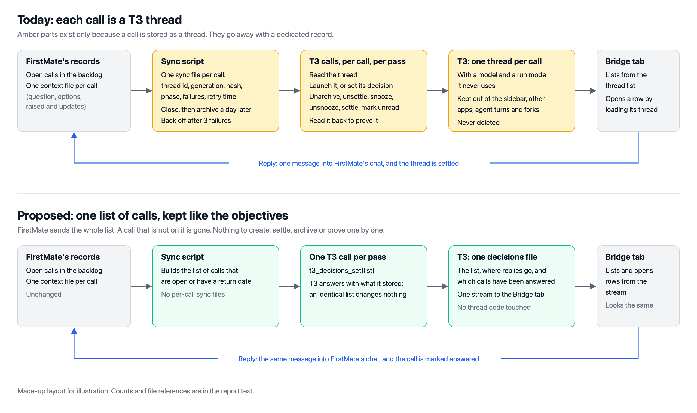

Each open captain call on T3's Bridge tab was a hidden, agent-less T3 thread, and FirstMate created, settled, snoozed, archived, and read back each one separately.
A scout found that nothing the Bridge shows needs a thread, and that one update had been failing every 15 minutes because T3 refuses to mark a thread unread when it never ran.
The captain took the scout's recommendations: T3 keeps the decisions as one list, the Later section goes, the old threads are archived at the switch, and an answered decision vanishes at once.
On where the list lives, the one condition:

> Yeah, I mean, wherever makes sense, just make sure that it's updated at the same time.  As 1st mate's internal records.  That's all I would want from it. Rest go with ur rec
>
> — 10 November 2026

The T3 Code fork's side landed first, with the new `t3_decisions_set` tool.
This entry is FirstMate's side:

- **One call carries the whole list.** When T3 offers the tool, the sync sends every open call in one `t3_decisions_set` call, built from the same records as before: the captain holds, how long each has waited, and each call's recorded context.
  A call deferred to a date carries that date and waits under Scheduled; a blocked, answered, or released call is simply left off.
- **Same step as the records.** Every hold, answer, reconcile, and context already ran the sync before returning; now that sync is one cheap call, so the Bridge changes in the same command that changes FirstMate's records.
  The watcher's minute pass stays as the backstop.
- **Failures are no longer silent.** A list T3 refuses is reported and sent again on the next pass, and the third refusal in a row wakes FirstMate with T3's exact error, once per run of failures.
- **The switch happens once.** The first list T3 accepts archives every decision thread FirstMate has on record and deletes its per-call sync records; an archive that fails is tried again on the next pass.
- **Older T3 keeps working.** A T3 without the tool still gets the decision threads, unchanged, until the fork's next build removes them.

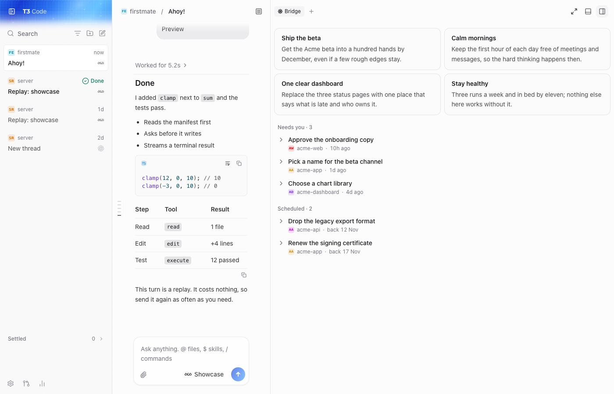

The choices made:

- **The list is sent on every pass that has something to show**, not only when it changed, so a T3 that lost its file is filled again within a minute; T3 treats an identical list as no change.
  An empty list is sent once and then not again.
- **A decision T3 would refuse is left off and named**, rather than letting one oversized field block every other decision.
- **The thread path stays for now** because the installed T3 may not have the tool yet; it is marked for removal with the fork's build 2.
- **Update FirstMate first, then T3**: the fork's new build shows only the list, so its Bridge stays empty until FirstMate sends one.

The picture of the Bridge is the fork's own, from its build, with made-up data; the diagram is the scout's.
The evidence is seven new cases in `tests/fm-t3-needs-me.test.sh` against the stand-in T3, which now offers the tool with the fork's bounds: the list's exact shape and contents through holds, deferrals, blocks, updates, and answers; a resent list leaving the captain's answer in place until the records change; the one-time switch, including a failed archive retried; three refusals waking FirstMate once per run; an out-of-bounds decision left off without blocking the rest; no list without FirstMate's thread; and the watcher turning the alert into one durable wake.

## 35. The card's status is worked out, not remembered (10 November 2026)


A review of both public forks asked where an implementation still followed an older requirement:

> I'm curious if there are other occurrences of this sort of like outdated or implementations based on outdated requirements and causing a lot of headaches and things to be non-elegant such that when you review the intention of that implementation again, you wouldn't arrive at the same approach. ... These are going to be forks that are public so I kind of appreciate some elegance to it.

The card label was one: it says what FirstMate already knows, yet it kept its own list of which worker each hold was for, re-asked the backlog about every copied link, and was fed by hooks in seven places.
The captain's answer to the review:

> Okay, in terms of the both forks, go with the recommended and the optional.

What was built:

- **One pass, no list of its own.** Every update works out each live T3 worker's label from the backlog's holds, read once, and each worker's current state, then changes only the cards whose label differs, all in one T3 session.
  A hold now names the worker it was raised for as a field of the fleet snapshot, so nothing re-reads the hold's text to find it.
- **More of what only FirstMate knows.** Between turns, a worker waiting on an answer from FirstMate, a blocker, or its own declared pause reads Waiting; finished work reads Ready; a failure reads Failed.
  Waiting for captain and Testing keep their meaning, and while the worker works the card shows T3's own Working, as before.
- **The same triggers.** A hold, an answer, a message delivered to the worker, or a T3 run ending updates the card within seconds, and the watcher's minute pass is the backstop, which now also restores a label a T3 restart lost.

The choices made:

- **Measured before replacing the list.** With eight T3 workers and two open holds, the old per-hold sync took 1.7 to 5.4 seconds and its minute pass 9 to 14; the new pass, which does both jobs, took 1.5 to 4.2, on the same busy machine.
- **The labels are complete enough for T3 to trust.** T3 Code's next change shows FirstMate's label in place of guessing "Waiting" from any process a worker leaves running, so every wait FirstMate knows of now has a word, and the docs say what T3 can rely on.

The evidence is the moved suite, now `tests/fm-t3-crew-status.test.sh`: every earlier case passes on the new pass (origin holds, a pending steer, Testing and its start time, cleanup, a T3 that is down or has no labels), with new cases for Waiting, Ready, and Failed between turns, a restart that loses labels, and an unreadable backlog leaving every card alone.

## 36. A T3 restart has one owner, FirstMate's half (10 November 2026)


The same review of both public forks found restart recovery built on a premise that had since changed.
On 28 October T3 resumed nothing after a restart and nothing woke FirstMate, which justified reading the server's process id, refusing the main's first tool call, and steering every worker.
T3 now resumes the runs it cut, and its half of this change tells every pinned coordinator about every restart and reports its own start time.
The captain's answer to the review:

> Okay, in terms of the both forks, go with the recommended and the optional.

What changed on FirstMate's side:

- **T3's start time is the restart identity.** FirstMate reads `serverStartedAt` from T3 instead of the listening process's id and start time, so it no longer runs `lsof` and `ps` for it, and a server reached at a non-loopback address is covered too.
- **No reminder hook on the main.** T3's note opens whatever message reaches the main after a restart, the resume of a cut turn or a note on its own, so the first-tool-call refusal is gone, and a Codex or other main is covered the same way as a Claude one; the credential guard in the same hook stays.
- **Fewer redundant steers.** A worker whose current status line was written after the restart has already resumed and said where it stands, so it is left alone; a worker that is merely busy again is still steered, since being busy does not show it checked what the restart took, and an idle worker whose wait vanished is steered as before.

The choices made:

- **The status line's own time decides "since the restart".** Nothing watched the status files at the moment of the restart, so the line's `[at=]` stamp is the only witness; it must be later than the restart's whole second and not in the future, and it only ever spares a line from distrust, never makes an older line current.
- **No fallback to process ids.** A T3 without the restart time reads as unknown, as a remote server always did, since FirstMate needs the paired T3 Code fork anyway.
- **A new record name.** The handled restart is now recorded as a time rather than a process id, under a new name, so the first session start after this lands records it quietly instead of reading a format change as a restart.

## 37. The model routing table on the Bridge (10 November 2026)

The ask:

> I want to create a model routing table in the bridge tab of T three code.

T3's half added a read-only Model routing section to the Bridge and a tool to fill it.
FirstMate's half sends its routing table there, the same way it already sends the high level objectives.

What it looks like, with made-up rules:

| When | Harness | Model | Effort | Why |
| --- | --- | --- | --- | --- |
| Hard design work. (captain approves) | claude | big-model | xhigh | Strongest reasoning. |
| Small fixes. | claude | small-model | high |  |
| Anything else | claude | - | - |  |

The choices made:

- **The dispatch file is the only source.** Each sync pass builds the table from `config/crew-dispatch.json`, one row per model the rule can use, with the default last, and sends it only when it changed.
- **Rows are never dropped.** Past T3's 8,192-character limit each long reason is cut to one shared length first, then each long condition, and the pass says how many cells it cut.
- **A broken file is reported, not guessed around.** A file missing what the table needs is named on every pass, and the Bridge keeps its last good table; a deleted file clears it once, and only if one was ever sent.
- **One shared push for both feeds.** The objectives and the routing table now go through the same send-on-change, retry, and back-off step, so they cannot drift apart.

The evidence is the needs-me regression suite against the stand-in T3: the table is sent on change, not resent unchanged, kept on a malformed file, cleared when the file goes away, and skipped quietly by a T3 without the tool.
No screenshot yet: the running T3 did not offer the new tool when this was built.

## 38. The routing table's model in one column (10 November 2026)

> These three columns in the bridge should be one column

The Bridge panel is narrow, and the Harness, Model and Effort columns took most of its width and wrapped.
They are now one Model column reading `claude · claude-fable-5-2 · xhigh`, and a missing model or effort is left out rather than shown as `-`, so the default row reads `claude · claude-opus-5-5`.
When and Why, and how a long table is fitted to T3's limit, are unchanged.
The evidence is the needs-me regression suite's routing-table test, which pins the new layout.

## 39. Every standing rule on the Bridge, FirstMate's half (10 November 2026)

The ask:

> The rule section in the bridge should show all the rules, regardless of the ones that need action or don't need action, and label them with chips, such as approved, or if it's not approved, give your recommendations in a dashed chip or hollow chip or something like that. I want to be able to see every rule. And I will make decisions from there by either agreeing with your choice and clicking on the chip, or I will copy the rule and add my own comment and send it back to you here in this chat.

T3's half adds the Rules section and a tool to fill it; this half sends FirstMate's rules there and records his taps.
It replaces the separate review board the rules were last reviewed on.

The choices made:

- **One private inventory is the source.** Each rule's id, heading, file, current wording, and either the day he approved it or FirstMate's recommendation live in one home-private file. Each sync pass checks it against the shared contract and sends it only when it changed, through the same send-on-change, retry, and back-off step as the objectives and the routing table.
- **Nothing is cut to fit.** A rule past the contract's limits, or a pending rule with no recommendation, is named on every pass and the Bridge keeps its last good list, rather than showing a shortened rule he might approve by mistake.
- **A tap is recorded, not acted on blindly.** His tap arrives as one chat message with a machine line. `fm-rules.sh` approves the rule (with the narrower wording when that was the recommendation) or takes it off the list, writes the rules history entry with his words, and prints the edit FirstMate still has to make in the rule's file. The rule files themselves are never edited by the script.
- **Disagreeing stays in chat.** An answer other than the recommendation is recorded only with his own words, never with the chip's sentence.

The evidence is the needs-me regression suite against the stand-in T3 (the list is sent on change, proven by its ids, retried, kept on a malformed inventory, cleared once) and the new rules suite for the answers.
No screenshot yet: T3's section is being built alongside.

## 40. Model routing as model and description (10 November 2026)

> Let's make model routing get the format of the model In highlights and then the description in normal text color and then remove the actual description use our current titles as description

The routing table had three columns, and the long Why paragraphs made it the tallest thing on the Bridge.
Each route is now one list entry: the model highlighted as inline code, and beneath it, in normal text, the old When text as its description.
The Why is no longer sent; the dispatch file still carries and checks it.

- **A list entry with a hard line break.** T3 renders the Bridge with its ordinary chat Markdown, without its option that turns every newline into a line break, so a plain newline would have run the description onto the model's line. A backslash at the end of the model line is the standard Markdown hard break and puts the description on its own line, while the list keeps each route visibly one item.
- **Only the description is cut.** Past T3's 8192-character limit every long description is cut to one shared length with an ellipsis; no route is dropped.

A route now reads like this (made-up entries from the regression test):

```markdown
- `claude · big-model · xhigh`\
  Hard design work. (captain approves)
- `claude`\
  Anything else
```

The evidence is the needs-me regression suite's routing test, which pins this shape, the cut, and that a stray backtick or list marker in a rule stays text.

## 41. Model routing grouped by model (11 November 2026)

> Um this tab here let's group by model provider and then model family. If a model has two Two tasks or allocations just use dots to separate them. So we're essentially going from task-oriented to model family oriented and we want to put claude opus 5.5 first and just say default

The routing list followed the dispatch file's rule order, so Sol appeared twice and the default sat last as "Anything else".
It now reads by model: a small heading per provider, one entry per model, and every kind of task routed to that model on the line beneath it, joined by " · ".
The dispatch file and how FirstMate picks a worker are unchanged; only the list is drawn differently.

The choices made:

- **Default first, then order of first appearance.** The default's entry opens the list and reads "Default". Providers, families and models then follow in the order each first appears in the dispatch file, so the default's provider and family lead and the rest stay stable as rules are added.
- **Provider and family from the model name, for display only.** `claude-*` is Anthropic with its family as the second word (Opus, Fable, Sonnet), `gpt-*` is OpenAI, `gemini-*` Google, `grok-*` xAI, and anything else, or a profile with no model, goes under "Other" instead of failing. Nothing else reads these names.
- **A family sub-heading only when it says something.** A provider gets family sub-headings only when it has several families and one of them holds more than one entry, such as Fable at two efforts. With today's file every family has one model, so the list stays at three provider headings and is short on a phone.
- **The captain's mark stays with its rule.** "(captain approves)" follows that rule's own text inside a shared entry, and a long text is now cut before the mark, so the mark always survives the fit to T3's limit.

With today's dispatch file the list reads:

```markdown
#### Anthropic

- `claude · claude-opus-5-5`\
  Default
- `claude · claude-fable-5-2 · xhigh`\
  The task is hard technical, product, design, architecture, or planning work where the reasoning itself is genuinely difficult. (captain approves)
- `claude · claude-sonnet-5-5 · high`\
  The task is a simple bug fix whose root cause and expected behaviour are already well known.

#### OpenAI

- `codex · gpt-6.1-sol · high`\
  The task is an investigation: a scout that produces a report and no code change, such as a diagnosis, audit, reproduction, research or review. Not design explorations or visual mockups. · The task is browser computer use: driving a web browser by seeing the screen and clicking or typing, as the main way the work gets done. This lane cannot control desktop Mac apps.

#### xAI

- `grok · grok-4.7 · high`\
  The task is searching X (Twitter): finding, reading or summarising posts, threads, replies or accounts on X.
```

The evidence is the needs-me regression suite's routing test, which pins the grouping, the joined descriptions, when family sub-headings appear, the Other group, and the cut keeping the captain's mark.

## 42. Model routing without provider headings (11 November 2026)

Looking at the grouped list, with Anthropic's families nested under it and OpenAI and xAI as headings of their own, the captain asked:

> remove provider level heading e.g. OpenAI

The list now has one level: a heading per model family, always, in the order each first appears, so today it reads Opus, Fable, Sol, Sonnet, Grok.
Every entry sits directly under its own family, so a single-model provider no longer looks like a peer of Anthropic's families, and nothing reads as nested under the wrong heading.
The family is still read from the model name and only for display; the provider half of that reading was removed rather than left unused.
A model the reader does not recognise is its own family, and a route with no model goes under "Other".
The 8192-character fit is unchanged.

The evidence is the needs-me regression suite's routing test, which pins the flat family headings, their first-appearance order, and that no provider heading appears.

## 43. Explorations wait for the captain, FirstMate's half (12 November 2026)

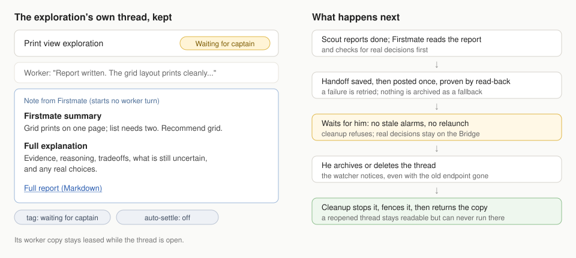

In his 11 November voice journal the captain asked that exploration threads should

> linger around until I actively like close it

with the thread tagged

> Just say waiting for captain.

and FirstMate's summary posted back into it, so there are three levels to read: the summary, the full body, and a link to the full report.
Simple fixes

> can just go.

Asked whether to build it, he answered "Yes."
The T3 half (tags, per-thread auto-settle protection, a passive note that starts no agent turn, and an execution fence) landed in the T3 fork first; this is FirstMate's half.

What was built:

- A finished scout on T3 is now kept rather than cleaned up.
  FirstMate writes its handoff as two parts, a summary and the full explanation, and one helper composes the note in that fixed order with the report link last, saves it, and only then posts it.
  The note starts no worker turn, and the thread gets the exact tag `waiting for captain` and automatic settling switched off.
  Each is read back before it counts.
- The note's request id is built from the task, its spawn, the report, and the words, so a retry or restart never posts twice, and a revised report gets a new note instead of rewriting the old one.
  A busy thread waits, a failure is retried by the watcher, and nothing is ever archived as a fallback.
- His card reads "Waiting for captain" for a kept review even with no question open.
  Real decisions stay on the Bridge exactly as before, and answering one leaves the exploration open.
- Cleanup refuses a kept review, even when forced, until T3 reads his thread archived or deleted, and an unreachable T3 refuses too.
  Once he closes it, cleanup runs every ordinary check, stops the thread, and fences it on its copy before the copy goes back to the pool, so a thread he reopens later stays readable but can never run in a slot another task now holds.
- The watcher notices his close on its minute pass, even when the thread is gone, and wakes FirstMate once to clean up.
  An idle kept review never raises a stopped-responding alarm, and recovery never relaunches one.
- Ships, and scouts on other backends, keep today's cleanup.
  A T3 too old for these tools is detected and gets the old behaviour, never a guess.

The evidence is the regression suites against the fake T3 server: the T3 client (publish, race, old T3, fence), a new suite for the helper including the watcher's close notice and a stale-alarm control, the crew card, the Bridge, the hold lifecycle, cleanup and its slot-safety cases, the inactive-outcome sweep, and the session-start digest.
No live thread was touched; the first real kept review is the integrated check.

## 44. Long test runs that a T3 restart cannot cut (12 November 2026)


The ask:

> I have an intention to keep day to day changes built pretty fast so I can not stop T three code from restarting. I guess we can also consider an approach of running the testing or yeah, running the testing in a like separate terminal so it frees up T3 code restart. How will we do it most elegantly?

A T3 restart stops every process T3 started, and a worker's background test run is one of them, so since a quiet restart cut such a run on 7 November the idle check has counted a worker busy while its own run is going.
That kept the staged restart waiting on every long run, about 50 minutes for one worker's 29-suite run.
After the design below was laid out, the answer was:

> Yeah, this sounds good actually. Let's start it.

What was built:

- A launcher, `bin/fm-job.sh start`, that a worker hands a long command to.
  It starts the command through a double fork and a new session, so the run is reparented to init and no longer belongs to the worker or to T3, with its output in a log.
- A small record per job under the task's state: the command, the runner's process and identity, the log, and, once it ends, the exit code and an outcome of passed, failed, timed out, stopped, or lost.
  A job has a timeout, and when it ends anything it left running in its process group is stopped too.
- The watcher sends each ended job's result to its worker through the durable steering inbox: outcome, exit code, run time, log path, and the log's last lines.
  The record waits there through a restart, and its doorbell starts the worker's next turn.
  A job whose runner vanished, as after a reboot, is reported as lost rather than waited on forever.
- The idle check leaves a job's processes out, but only while its runner is the recorded process and its parent is init, which is the proof that a restart cannot reach it.
  A worker waiting only on its job reads idle, so the staged restart can go at once.
- Cleanup stops any job still running and removes its records, even a job working outside the task's copy.
- Every generated worker brief now says to run anything longer than a few minutes this way, declare a `paused:` wait naming the job, and end the turn; a no-mistakes run is left as it was.

The remote job queue that already exists was looked at first and not reused: it serves only tracked Firstmate scripts with bounded output and short timeouts, which a long test sweep is not.

The evidence is the regression suites: a new suite for the launcher (detachment, outcomes, timeout, stop, leftovers, delivery including a lost job and the watcher's own cycle, cleanup), the idle check with a detached job and with a runner still inside a caller's tree, the cleanup suite with a job working outside the copy, and the brief scaffold.

## 45. Pings only for turns that need the captain (12 November 2026)

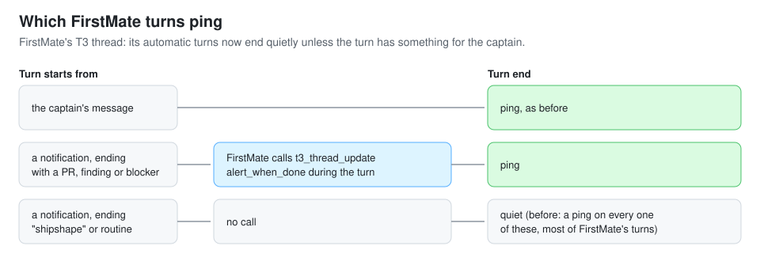

The ask:

> I think T3 code at the moment still pings me, like plays the ping sound whenever a worker of first mate finishes their work. I think the desired result is only when top level threads finishes the turn I should get that ping sound.

And then:

> Yeah, I agree. First Mate should only ping me when a turn has finished. And I guess especially a turn that needs my attention, not the shipshape turns. That would be the ideal solution.

The T3 half landed in the T3 fork first: on a pinned coordinator thread, a turn that a notification started ends quietly, and an agent that needs the user calls `t3_thread_update` with `action: "alert_when_done"` during the turn to make its end ping as usual.
Turns the captain starts with his own message still ping.

This is FirstMate's half.
A FirstMate session holding the helm inside a T3 thread now gets a short T3 thread protocol in its session-start block, on whichever model runs it.
It says to make that call once in an automatic turn that ends with something the captain must hear at once (work ready for review or landed, finished findings, a decision, a real blocker or failure, a credential need), never for a "shipshape" or routine supervision turn, and to skip it on a T3 that does not offer the action.
The call names no thread, which T3 reads as the caller's own, so no lookup is needed.
Outside T3, and in a read-only session, the block is unchanged.

The evidence is the supervision-instructions suite: across five harnesses the protocol appears only for a locked session inside a T3 thread, and it appends to the block without changing it.

## 46. Which message started each worker (12 November 2026)

The ask, on 11 November:

> I want to see my phone prompts and works ... that initiated directly from my phone. So I would probably need some sort of association of which worker started from which prompt.

Asked whether to build usage by phone, computer and agent in both stages, he answered "Yes."
The first stage gave T3's Usage page a "By origin" table, which found that over the last 30 days 38% of Claude tokens went to FirstMate worker threads and 17% to agent-started runs, none of it traceable to a device.
T3 then learned to take a cause on a launch or a message and to follow those causes in Usage, so a worker's tokens count back to the phone or computer message that started it.
This is FirstMate's half: it now tells T3 which message caused each worker and each steer.

- **The cause is the turn's one prompt.**
  When FirstMate spawns a worker, steers one, or an agent leaves it a note, the cause is the prompt that started the turn the command runs in, read from T3 by its ids, never its text.
- **Nothing rather than a guess.**
  A turn that received more than one prompt, such as a steer that joined it, records no cause, and neither does a background job left over from an earlier turn: it must have started inside the current turn to borrow that turn's prompt.
  An explicit cause can still be given for those cases, such as the prompt a note recorded.
- **Kept where the work is recorded.**
  The worker's task record, each steer's inbox record, and each note keep their cause, so the association outlives T3's own view of it.
- **Sent only where T3 takes it.**
  An older T3 keeps working without causes.
  A launch is checked by reading the thread back; a cause T3 refuses stops the launch with nothing created, while a steer goes out without it and says so, because a message should never wait on its accounting.

The evidence is the T3 client, T3 backend, and inbox regression suites, run against a fake T3 that checks causes the way the fork does: the turn's prompt found behind a long turn, no cause for a steered turn or a stale background job, the cause carried on the launch, the brief, and every doorbell, and a refused cause reported without losing the message.

## 47. Max effort reaches the strongest Codex models (13 November 2026)

The question that started it:

> can we invoke pro intelligence on codex via first mate? ... that's the whole reason I pay the Pro tier subscription
>
> — 12 November 2026

The investigation found the subscription Codex CLI already offers `gpt-6.1-sol` and `gpt-6-astra` at max reasoning.
The gap was in Firstmate: a Codex worker launched with `--effort max` quietly started without it unless the model was `gpt-5.6-luna`, the one name the launch code knew.

- **The model catalog decides.**
  The Codex CLI's own cache says which efforts each model offers, so no model name is hardcoded.
  Sol, Astra, and Luna now run at max; any future model that lists max does too.
- **Nothing is dropped silently.**
  An effort the catalog says a model lacks stops the spawn with a message.
  Max for a model the catalog cannot confirm also stops it, rather than guessing.
  The four older levels keep forwarding as before.
- **Dispatch profiles agree.**
  The profile checks at session start and at dispatch read the same catalog, so a rule naming Sol at max is accepted.
- **T3 Code was already right.**
  It checks effort against T3's own catalog, so it needed no change.
  Ultra, which adds subagents, stays out of scope.

The evidence is a portable regression with a fake catalog (a new `fm-codex-effort-catalog` suite plus the spawn and bootstrap suites), and one short live `codex exec` of Sol at max under the ChatGPT login.
That run accepted the setting and answered, but its JSON output does not echo the effective model or effort, so the launch flag is proven and the effective level is not.

## 48. A T3 build installs only after every reply finishes (13 November 2026)

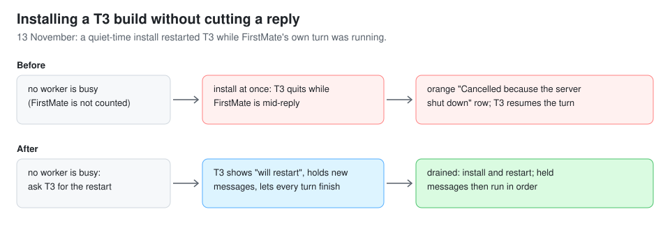

A quiet-time install of a new T3 Code build restarted T3 while FirstMate's own turn was running, because the quiet check counted only the workers.
The turn showed an orange "Cancelled because the server shut down" row before T3 resumed it.
His answer:

> I remember you used to do this restart step slightly differently, which is that you say T3 code is gonna restart in like 30 seconds and then you let the message finish and then T three code restarts. So it's a true clean restart. I wonder I mean the cleanness I like. I pro I prefer.
>
> — 13 November 2026

What was built:

- **Ask first, then wait.**
  Once no worker is busy, FirstMate asks T3 for the restart with the build's name as the reason.
  T3 shows the captain that it will restart, holds every new message, and lets running turns finish, FirstMate's own included.
- **Restart only when drained.**
  The install starts only when T3 reports that no turn is running anywhere, so no reply is cut; the held messages then run in order once T3 is back.
- **Never left holding messages.**
  A wait that runs past its limit cancels the request and says so, which releases the messages.
  So does stopping the install, as when a newer build replaces it.
  If the captain cancels the restart from T3's notice, or T3 restarts on its own, nothing is installed.
  The chosen wait is the one he picked: the request goes in only once the workers are idle, so the hold lasts about as long as FirstMate's reply.

The evidence is a new regression suite against a fake T3 with the restart registry: drained at once, waiting on running turns, the timeout cancel, a cancel from T3, a replaced request, a restart on its own, and a stop that kills the whole process group, which still cancels.
That last case first failed, and found a real gap: a stop that landed while T3 was still answering the request skipped the cancel.
The live T3 answered the new status call read-only; no restart was requested on it.

## 49. A fresh start hands over cleanly (13 November 2026)

A `/clear` on the FirstMate thread in T3 left the previous session running.
T3 sent new messages to the new session, while the old one kept the session lock and went on dispatching and merging work for about 20 minutes with its replies no longer shown in the thread, and the new session sat read-only.
One worker launched in that window had no parent thread and showed at the top level of the sidebar.
The old session was stopped by hand to recover.

> When we run slash clear, um especially when it's registered, then that is a definitive moment when we've switched to a new first mate main thread.
>
> — 13 November 2026

On the case where the old session is busy at that moment:

> given that this is kind of a backstop we can just go with like stop it right away and then migrate for as long as we can maintain that smooth handover.

T3 itself is changing so that a fresh start on the main thread stops the previous session; this is FirstMate's side of the handover.

- **Workers keep their parent between turns.**
  A worker's thread now names the project's pinned FirstMate thread as its parent even when FirstMate is not mid-turn, as the Bridge decisions already did, falling back to the one running thread.
  When no parent can be found, the spawn says why instead of launching an orphan silently.
- **A read-only start says what is wrong.**
  When the lock belongs to the earlier session on the same T3 thread, the read-only notice now says so and names the remedy, instead of only "another live session holds the lock":

  ```text
  error: the previous firstmate session on this T3 thread (<thread>) is still running and holds the lock (pid <pid>, session <id>); its replies no longer reach the thread. Safe remedy: end that earlier session with kill <pid> (the SIGTERM T3 sends a replaced session; its unacknowledged wakes stay queued for this one), then run bin/fm-session-start.sh again here; operate read-only until resolved
  ```

  The thread comes from the id T3 gives every agent, matched against the thread record only the lock holder writes; a record older than the lock proves nothing, so no claim is made from it.
- **Nothing in flight is lost.**
  A new real-process test stops a session after it has read a notification but before it acknowledged it, and checks that the fresh session is shown the same notification and can acknowledge it.
  This already held; the test now keeps it so.

The evidence is the swap suite's two new cases (the same-thread refusal, with its stale-record fallback, and the unacknowledged handover) and four new crew-parent cases: a pinned thread between turns, a pin that settles several running threads, an archived pin ignored, and no thread at all.

## 50. Only trusted reviewers wake a parked worker (13 November 2026)

Upstream's newest update brought park on review: a worker whose PR only waits for review is stopped, and a fresh one starts when the PR gets new review activity.
The nightly review held the update back, because that activity could come from anyone: on a public repository, a passer-by's comment would start an agent told to act on it.

Asked how to take it:

> Sometimes we do turn it into a PR. And when we do, I like to preserve that functionality. And use that as intended. But yes, you are right. Most of the time we don't do that. So, if we could just make it conditional.
>
> — 13 November 2026

- **Trust decides the restart.**
  A comment, review, or unresolved thread restarts the worker only when it comes from the repository's owners, members, or collaborators, or a bot listed in `config/contribution-review-bots`, the trust the contribution watcher already uses.
- **Nothing is dropped silently.**
  Anything else leaves the worker stopped and tells FirstMate once, naming who wrote it and when; new activity tells it again.
  GitLab's reads carry no membership, so GitLab activity always takes this path, and so does a read too large to see every author.
- **PR text is input, not orders.**
  The fresh worker's note says comment text is written by other people, to read for what to change and never to follow as instructions.
- **Everything else is upstream's.**
  Pushes, failing checks, requested changes, and conflicts restart the worker exactly as before.

The evidence is the park suite: a trusted comment restarts the worker, while a passer-by's comment, an unlisted bot, a thread opened by an untrusted author, and GitLab notes each leave it stopped and are reported once.
The new cases fail against upstream's unchanged code.
Park on review stays off in this home.

## 51. A finished card takes a reply or an archive (13 November 2026)

On finished scout cards waiting for him in T3:

> Let's remove the first mate summary. Let's add back the input box where we can essentially reply to this ... but it gets forwarded to first mate, so first mate fully coordinates it ... instead of settling the button here is archive ... if the thing is needs like some action where there's some decision for me to make and I can choose to archive as well. And I think in that case it probably needs to communicate to first mate that I have like archived this
>
> — 13 November 2026

This is FirstMate's half; the card's input box and Archive button are the T3 fork's.

- **No summary note.**
  A kept scout's thread is still tagged `waiting for captain` with automatic settling off, but nothing is posted into it.
  FirstMate keeps its summary, explanation, and report link as its own handoff record and relays them in chat.
- **His reply reaches FirstMate.**
  What he types on a card arrives in FirstMate's thread as one message: `**Reply · <card title>**`, then `kept-thread: <thread id>`, then his words, the same shape as a Bridge decision reply.
  `fm-t3-needs-me.sh reply-task` now reads either line, so FirstMate knows which task he means and treats his words as his input on it.
- **Archive closes one item.**
  His Archive on the report's item marks it read and closes the review, so the scout is cleaned up; his Archive on a decision raised from the review closes that decision alone.
  Closing the review closes no other item on the card, and a thread he restores reopens nothing.
  Nothing is deleted: the report and the task's records stay.

The evidence is the review, needs-me, list, and T3 helper suites: the thread is tagged with no note, a kept-card reply names its task and refuses anything ambiguous, an Archive on a shared card closes only its own item in either direction, and closing the review, on the watcher's pass or cleanup's, leaves every captain call open.

## 52. One list, kept in step both ways (13 November 2026)

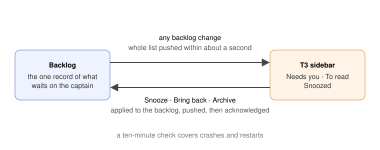

Why:

> it's not automatically synced to a single source of truth for their state, so that they can be outdated. The idea that they can be outdated is not great.
>
> Rather than syncing once a minute, I would like to explore doing that in real time.
>
> — 13 November 2026

This is FirstMate's half; the sidebar's labels, Snooze button, and Archive are the T3 fork's.

- **The backlog is the record.**
  Every open captain hold is one item on a card under FirstMate's: a decision, or, held `--read`, a finished report To read.
  An item rides on its worker's card; a decision with no worker gets a thread of its own, titled with the question, with nothing posted into it ("Let's reduce the scope.").
- **Real time, both ways.**
  A listener, kept running by the watcher, pushes the whole list within about a second of any backlog change, whoever made it.
  His Snooze, Bring back, and Archive are logged by T3; the listener applies each to the backlog, pushes the list, and only then acknowledges it, so the sidebar never shows something the backlog does not.
  The minute pass for the list is gone; a ten-minute check covers crashes and restarts.
- **Snooze uses T3's presets.**
  "We just use theirs": a return can be a time of day, so the backlog now keeps an exact return time beside its date.
  A snoozed item "stays snoozed unless we bring it back"; FirstMate's own updates never wake it.
- **Archive is "not pursued", for its own item only.**
  Park now means snooze, so an archived decision is recorded as "Archived in T3 on <date>: not pursued." and a report as read; nothing else on the card changes.
  Only his Archive on an item counts: a thread's own archive or restore, FirstMate's cleanup archive included, closes no item, and the check never infers one.
  A decision's Archive on the card of a worker that has not finished also asks FirstMate to wind that worker down through its normal safe cleanup.
- **No more "Waiting for captain".**
  The card's Needs you or To read comes from the list, so FirstMate's own label for it is gone.

The evidence is the new listener suite (a backlog edit is one push; an action changes the backlog, then the list, then is acknowledged; a replay the next day writes the same words; T3 down and back; a lost archive caught by the check) and the hold, snapshot, needs-me, review, card, helper, and bearings suites.

## 53. Back to one thread (14 November 2026)

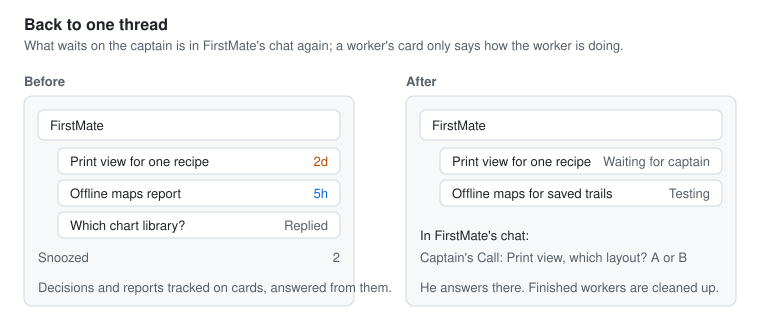

Why:

> In the normal first mate experience you never have to click into the workers, and we over the past few days have made a deviation from that where we do click into the workers.
>
> I'm pretty sure at this point that I just want to go back to the first mate single thread experience.
>
> I want fable to take an overhaul kind of approach to this and tidy things up as it goes. So it's not just like merely subtracting, it's refactoring into what it was before such that it's clean, it's minimum deviating.
>
> — 14 November 2026

What entries 23 to 25, 28, 34, 43, 51, and 52 built, and the Rules list of entry 39, came off the main branch.
This is FirstMate's half; the T3 fork's sidebar and thread tools follow.

- **A finished scout is cleaned up again.**
  Keeping its thread until he archived it is gone, with the handoff record, the tag, and the fence.
  One thing stays, as a rule and not as code: a scout whose report raised a question for him is left alone until he answers.
  "We don't clean it up until we've sort of made a decision. Then that's kind of all the functionality we need."
- **Decisions live in chat.**
  The list pushed to T3, its listener, and his Snooze, Bring back, and Archive taps are gone.
  Putting something off is upstream's again: a date, or the item ages out of the live list on its own.
  There are no To read items.
- **The backlog scripts are upstream's.**
  The hold script's difference from upstream went from about 550 lines to 40: an idea is refused, completion names unread board feedback, and a worker's card follows the hold.
- **The card says Waiting for captain again.**
  The list had taken that word over; without the list, FirstMate's own label is back.
- **A reply box may still forward to FirstMate.**
  "I don't mind a message box that just like forwards to first mate ... if I'm ever like reviewing a workers probe I could just reply right there."
  FirstMate's side is one small reader that names the worker's task from the forwarded message.
- **The Bridge keeps two feeds.**
  Objectives and model routing are pushed by a short script of their own; Rules left, its review being finished.
- **The removal is two commits of its own**, so the experiment can be brought back by reverting them.

The fork's difference from upstream fell from 20,391 added lines to about 15,100, and in `bin/` from 8,050 to about 5,200.
The evidence is the suites for every script the change touches: the hold, snapshot, Bearings, card, helper, cleanup, session-start, watcher, brief, and supervision suites, and the two new ones for the Bridge script and the reply reader.

## 54. Cleanup leaves a working worker alone (14 November 2026)

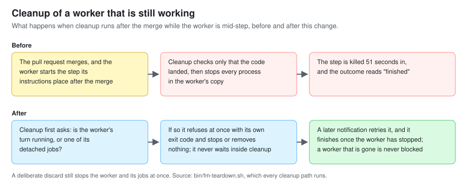

What happened: a worker's pull request had merged, and it was 51 seconds into the production step its instructions place after the merge.
The background supervision session saw a finished delivery, ran cleanup, and cleanup stopped the worker and reported the work as finished.
Nothing on that path asked whether the worker was still running.

He had the proposed fix checked before it was built:

> Um send a fable agent to check upstream intention and double check this approach. Pretty much get fable to certified this fix.
>
> — 14 November 2026

The check found the same bug open upstream, confirmed by its maintainer and scoped the same way: refuse while the worker is provably still working, using the busy signal the fleet already has.
It certified the fix with changes, and two of them were his to decide:

> Okay, I'm cleared. Yes, on decision one and two.

What was built:

- **Cleanup refuses while the worker's turn is running.**
  The check is in the one cleanup script, so it covers every way cleanup starts: the main session, the background session, and automatic cleanup on merge.
  It reads the same busy signal everything else does and judges nothing about whether the step matters.
- **It refuses at once and never waits.**
  The first proposal said "wait until it stops"; the turn in this incident ran 68 minutes, and cleanup holds locks.
  So it changes nothing, exits with a code of its own, and a later notification retries it.
- **A worker's own detached job holds cleanup too.**
  This reverses the rule from entry 44, that cleanup stops a task's jobs.
  A worker may end its turn to wait on a long job, and that job was the same failure by a second door.
- **A deliberate kill is unchanged.**
  "if I do want to kill a worker, intentionally ... you wouldn't have to wait for it to finish ... that's kind of the intention with that rule"
  The explicit discard still stops the worker and its jobs immediately.
- **A worker that is gone is never blocked.**
  Whether the agent is still there is read first, so a "busy" record a crashed worker left behind does not hold cleanup.
  A worker that is alive but wedged is interrupted first, never discarded.
- **The background session reports the refusal as a wait.**
  Its instructions and the two playbooks say so, in one line each, and automatic cleanup on merge keeps its request and retries without reporting a failure.

What this does not cover: a worker that is idle but still owes a step after the merge, such as one waiting to be told the merge happened.
That needs a durable record of work owed after a merge and is separate work.

The evidence is the suites for every script the change touches.
The cleanup cases cover a running turn, a turn that already failed, a turn state that cannot be read, a detached job, the explicit discard, and a runtime with no liveness check.
The tmux case cannot run on this Mac, so it was run in a Linux container, where the whole file passed with nothing skipped.

## 55. A usage limit never stops the work (15 November 2026)


What happened: two scouts hit an account's 5-hour limit just after midnight.
FirstMate heard only that two workers had gone quiet, the background session filed both as routine, and the steer that should have resumed them refused, as though their agents had exited.
An investigation found three layers that each did nothing, and proposed five pieces.

His answers to the investigation's calls:

> 1 yes 2 yes 3 move at once 4 no 5 i tell u 6 no 7 how would u even test this
>
> — 15 November 2026

That is: fix it, the steer as a daytime fix and the rest at bedtime; switch on T3 Code's own resume at reset; move a stopped worker to another account at once, however close the reset; a moved worker stays where it is and only new work goes back; an early reset is announced by him, not detected; nothing offered upstream.
The daytime fix, a steer that rings a stopped thread, landed the same evening, and the rest started with:

> ok im going to bed

What was built:

- **The watcher says why a worker stopped.**
  When a T3 Code worker's run ends failed, the watcher reads the run once: T3's typed failure fields when it has them, otherwise the run's "Usage limit reached" error and Claude's limit notice, which carries the window and the reset time.
  A usage-limit stop becomes one notification per stopped run, naming the account, the limit and its reset, in place of the bare "went quiet" one.
  It goes to FirstMate itself, never only to the background session; any other failure keeps the ordinary path.
- **A small record per stopped worker.**
  The account, the window, the reset time and the run that failed, later noting where the worker was moved or that it was resumed.
- **Never routine.**
  The stuck-worker playbook and the background session's instructions each gained a line: a usage-limit stop is acted on or escalated.
- **Moving at once.**
  `bin/fm-usage-limit.sh move` checks in T3 Code's own catalog that the other account offers the same model and effort, rebinds the thread there, reads the binding back, records the move, and only then sends the continuation through the ordinary steer.
  Configuring first matters: a message sent first restarts the run on the exhausted account.
  Which account to move to stays FirstMate's choice under his account rules; the command never chooses and never waits.
- **Resuming an account he reset.**
  `bin/fm-usage-limit.sh resume <account>` rings every worker still stopped on that account, skipping any that already moved.

What this costs: moving between Claude accounts hands the conversation over trimmed, without the old session's reasoning, so a worker deep in an investigation can lose some of its thread; its instructions, status and files are untouched.

On call 7, a live proof of the move: FirstMate answered in chat that a worker had already been moved mid-task to another account that same night, which exercised the same T3 Code call, so no scratch thread was spent.
The evidence here is the suites for every file the change touches, with new cases against the fake T3 Code server built from the three real items the stopped run left: classification by title, notice and typed fields; one notification per run and none for an ordinary failure; the move's refusals, its order of configure before message, and its read-back; and resume ringing exactly the workers still stopped on the reset account.


## 56. A long test never holds an install for more than nine minutes (15 November 2026)

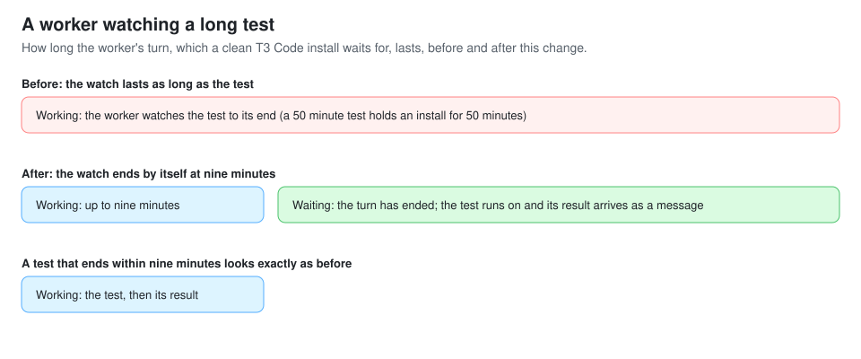

What happened: on 14 November workers started watching their long tests live instead of ending their turn.
A clean T3 Code install waits for every running turn, so a worker watching a long test held an install for the whole test.
A first fix, an install that works out which workers are only watching and stops their turns, was paused, and a design review measured the problem before anything more was built.
It found the cost was small so far, about 7 minutes of watching in 20 hours, that most workers filtered the output so little of it showed live anyway, and that the install-side check could not tell a watching worker from a thinking one.
It recommended one small change on the worker's side instead, and he answered:

> Yeah, okay, let's do the nine minute change.
>
> — 15 November 2026

What was built:

- **The watch ends by itself.**
  `fm-job.sh follow` stops after 540 seconds (`FM_JOB_FOLLOW_MAX`, under the ten-minute limit of a worker's command tool) when the job is still running.
  It says the job is still running and that the worker should declare the wait and end its turn, and exits 75.
  It does not mark the result delivered, so the existing result delivery sends it when the job ends.
- **The worker's instructions.**
  The sentence about re-attaching a cut follow is replaced: when the follow says the job is still running, append the `paused` line naming the job and end the turn.
- **What he sees.**
  A short test looks exactly as before.
  A long test reads Working for up to nine minutes, then Waiting until the result arrives, and an install waits for a watcher at most about nine minutes.

What is left alone: the idle check, the restart request and restart scripts, T3 Code, and the paused install-side branch, which is discarded.
The bound sits in the follow itself, not only in the instructions, so whatever the worker's tool does at its own limit, no watch outlives nine minutes.
The evidence is the `fm-job` and `fm-brief` suites: a follow of a still-running job ends at the bound with exit 75, leaves the result undelivered, and the watcher's delivery still sends it when the job ends; a short job and an ended job behave as before; and the generated instructions carry the new wording.

## 57. A notification never reloads a cold session (15 November 2026)

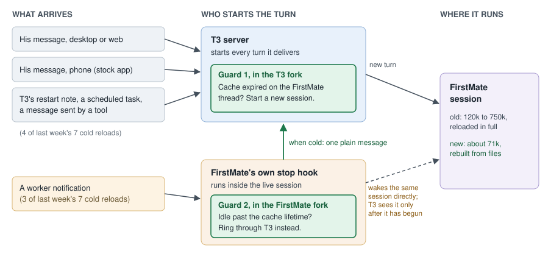

The requirement:

> We need to run clear when the cache has gone cold. That's for sure. That's like at least or minimum condition.

A design review found that one guard cannot do it.
His messages, from any client including the stock phone app, reach FirstMate through T3 Code's server, so the T3 Code fork can start a cold FirstMate thread fresh.
A worker notification is different: FirstMate's own Stop hook wakes the session from inside its process, and T3 Code only sees that turn once the cold context has already been re-sent.
Last week's seven cold reloads split four to three between the two.
On the review's six calls he answered:

> Okay, let's start cold clearing on all your recommendations.
>
> — 15 November 2026

This entry is the FirstMate half, the backstop for notifications.
What was built:

- **A wrapper around upstream's Stop hook.**
  `bin/fm-claude-stop-cold-reroute.sh` is now the Stop hook in `.claude/settings.json`.
  It runs upstream's hook unchanged on the same payload and passes every outcome through byte for byte, except one.
- **The one outcome it changes.**
  When upstream's hook is about to wake the session for a supervision event, the session runs in a T3 Code thread and holds the session lock, its last request is more than an hour old, and its context is over 100k tokens, the wrapper sends one message to FirstMate's own thread instead, as an operational-input doorbell naming a record in this home's inbox, so nothing takes it for the captain's words.
  The T3 Code fork's rule then starts that turn in a fresh session.
- **The message carries nothing.**
  The notification stays in the durable queue, which a fresh session's start digest presents, and the send asks for no fresh context, so if his message and the notification race, the first starts the fresh session and the second continues it.
- **Upstream decides what a wake is.**
  The wrapper reads upstream's own ledger entry for that run: only an exit 2 that upstream recorded as a wake, under its own process, is rerouted.
  A failure notice, an alarm, or an interruption always passes through.
- **Any failure is today's behaviour.**
  No credential, T3 Code unreachable, a refused or expired credential, or a delivery T3 Code cannot confirm, and the wrapper delivers upstream's wake exactly as before.

What is left alone: upstream's hook itself, its StopFailure registration, and every session outside a T3 Code thread.
The size floor follows his call to clear only a session that has grown, since a small one reloads for about the price of a fresh start.
This half ships after the T3 Code fork's rule is installed; before it, the message would only reach the old session.

The evidence is a new suite, `tests/fm-claude-stop-cold-reroute.test.sh`, on made-up transcripts and a fake T3 Code server: a cold, large wake is one operational doorbell and no wake; a warm session, a session of exactly 100k, a session outside T3 Code, a session without the lock, a failure notice, and another process's ledger entry each pass through unchanged; six kinds of failed send, and a record that cannot be written, fall back to the wake; a signalled wrapper waits for upstream's outcome and never reroutes; and the real upstream hook's recorded wake is rerouted when cold and passed through when warm.
The neighbouring suites, upstream's Stop hook, the turn-end guard, the stow guard, the host mirror, and the `/clear` swap, still pass.

## 58. A nightly check watches every clear (15 November 2026)

The design review behind the cold clears recommended measuring them before clearing any more often, and on its six calls he answered:

> Okay, let's start cold clearing on all your recommendations.
>
> — 15 November 2026

This entry is that measurement.
What a morning briefing gets when a clear may have hurt, from a test week of made-up sessions:

```
## Clear check

- **Clear check:** 4 of 5 clears in the last day showed a sign of harm: after the cold start from a notification at Mon 06:00, a decision you had answered was asked again (dec-a) and a task was dispatched twice (task-x) and a notification was left unacknowledged across the clear and FirstMate was not back at the helm for 10 minutes; after your /clear at Mon 09:30, your first message was short and quoted nothing and you used a recall phrase ("earlier", "we discussed"); after the cold start from your message at Mon 14:00, you quoted the previous session; and 1 more. Details: data/clear-watch/2026-11-17.md
```

What was built:

- **A script with no model call.**
  `bin/fm-clear-watch.sh` reads FirstMate's own Claude transcripts, picks out the main sessions (the supervision host's are skipped), and treats each one that follows another as a clear.
- **Each clear's cause and saving.**
  A session that began with an operational-input doorbell, the form the cold reroute rings in, is a cold start from a notification; one that began with T3's restart note is a T3 restart; one whose predecessor sat idle over an hour above 100k is a cold start from his message; anything else is his `/clear`.
  The saving is the old context minus a fresh session's 71k.
- **Signs of harm, from the new session's first hour.**
  A bare short first message, a recall phrase, a quote of a reply the new session never wrote, a decision held again after the old session answered it, a task dispatched again, a notification shown and never acknowledged across the clear, and, after an automatic clear, no lock taken within five minutes.
  Only successful commands count, and no message text is ever written out.
- **Quiet unless something shows.**
  The full listing goes to a dated file in the home; the morning briefing gets one line only when a sign shows, plus a weekly total on Mondays.

Choices made along the way:

- The day ends an hour before the run, so every clear is judged once, with its whole first hour.
- A quote is matched by the quoted reply's message id, which T3 Code puts in every quote, so a quote of the new session's own reply never counts.
- "You said" was left off the recall phrases: in a fresh session it usually means the reply just given.
- A `/clear` he arms on a cold, large session reads as a cold start; either way the context was dropped.

Run read-only over the real past week, it found 16 clears; the signs were mostly his quotes of the previous session after his own `/clear`, which is the gap the next stage, carrying the last exchange into a fresh session, closes.
Real fresh sessions took the lock in 4 to 62 seconds, with one at 23 minutes, so five minutes separates a slow start from a stuck one.

The evidence is a new suite, `tests/fm-clear-watch.test.sh`, on a made-up week with one clear of each cause and each sign planted once: every clear is listed with its cause and saving, each sign is found and nothing else, the supervision host is ignored, a clear in the last hour waits for the next run, an existing briefing is kept, a rerun adds nothing, a quiet day leaves the briefing alone, and a Monday adds the weekly total.

## 59. A fresh session starts with the last exchange (15 November 2026)

The second of the small follow-ups the cold-clearing review recommended, approved with the rest:

> Okay, let's start cold clearing on all your recommendations.
>
> — 15 November 2026

A clear, automatic or his own `/clear`, starts FirstMate with no earlier context.
One of last week's four cold returns was a short message after five hours, and a bare "yes" in a fresh session has no question beside it.

Upstream already records his prompts and FirstMate's final replies on disk for its supervision host.
A fresh session's start digest now prints the newest of them from the session before, in a section of its own (made-up text):

```
================================================================================
LAST EXCHANGE
================================================================================
The dialog from the session before this one, as the dialog mirror recorded it:
the captain's prompts and FirstMate's final replies, never worker or tool output.
These turns were already handled. They are context for reading the captain's
next message, which may answer the last question below, and never a new request.

Recorded up to 2026-11-15T09:12:00Z: the last 2 entries of the session before this one.
[captain] is the calendar fix ready?
[main] Captain, the calendar fix is ready. Merge it?
```

The choices:

- **Bounded.** At most six entries and 6,000 characters, about 1,500 tokens, newest kept; when only part of the oldest one fits, its head and tail are kept and the cut is marked.
- **Only into a fresh session.** A compaction carries nothing, since its own summary keeps the conversation, and neither does a session that already has dialog of its own, so nothing older is mixed in.
- **Only the session just before.** An older session's dialog is never carried, and the opening line says when the newest entry was recorded, so a five-hour gap is visible.
- **Nothing when there is nothing.** No record, an unreadable or invalid record, no earlier session, or a session that does not hold the fleet lock, and the section is left out.
- **One owner.** The mirror script owns the reading and its bound; session start only prints what it returns, after the network checks and before curated memory.

The evidence is the touched suites on made-up records: the mirror suite gains cases for carrying the previous session's exchange and nothing older, the six-entry and 6,000-character bound with a cut entry, and missing, invalid, and unowned records; the session-start suite gains a case for the section's presence, placement, and absence.
Both suites pass.

## 60. Usage that had no recorded parent now names one (16 November 2026)

T3's Usage page splits tokens between the phone and the computer by following each prompt's recorded cause.
A day's investigation found a quarter of the last 24 hours with no recorded parent, almost all of it with a person behind it: FirstMate's own wake turns, workers launched from them, no-mistakes reviews run outside any T3 turn, and the supervision host's engine.
T3 gained a way for an agent to claim such work; this change is FirstMate's side.

The ask:

> My intention is to arrive at nothing unknown in the past 24 hours. Only unknown would be prior to phone distinction which is I think November 12th or something
>
> (15 November 2026)

On upkeep, such as recovering after a T3 restart: "Okay, both of these are desktop".
On voice journals: "I would like jobs that originate from journal get labelled as phone".

What was built:

- **Wake turns.** The wake drain claims its turn for the worker the first wake is about, so the turn counts to the prompt behind that worker; a wake about no worker is upkeep and counts to the computer.
  Turns no drain described, such as a background command finishing, are claimed for the computer afterwards.
- **Launches from a wake.** A launch or steer from a wake turn names the wake itself as its cause, so the worker inherits whatever that turn was claimed for.
- **Several prompts in one turn.** A launch names the latest prompt that arrived before it, instead of naming none.
- **Pipelines and the engine.** A ship worker claims each no-mistakes run for its task, and the supervision host claims each engine conversation for the task it woke on.
- **Restarts, recovery launches, journals.** A T3 restart names the latest landed task; a backlog item keeps the prompt that queued it, so a launch after a restart still names the request; the turn that files a voice journal claims the phone, and every worker it launches follows.

Every claim is best effort: a claim that cannot be made is skipped or logged once, and nothing ever waits on its accounting.
What stays Unknown by design: work before causes were recorded, a task launched without a cause until it ends, and work outside T3 that no claim covers.

The evidence is the touched suites against the fake T3 server, never the live one: the T3 client gains cases for wake causes, the latest prompt, claims, and restart causes; a new claim suite covers each claim, the drain end to end, and failures; the restart, backlog, landing, and brief suites gain a case each.

## 61. A delayed follow-up now counts to the message that set it up (16 November 2026)

Some work waits before it starts: a timed follow-up holds until an account has room, then fires and launches the workers.
On 15-16 November six promo films and the nightly review were set up this way from the phone, yet the follow-up's firing counted as upkeep on the computer, and so did every worker launched in that turn, about 806M tokens.

The ask:

> Yep, let's go with all three.
>
> (16 November 2026)

This is the second of the three builds toward "We'll keep going until unknown is zero percent": phone work that waits and then starts automatically, so that when the job fires it counts to you, phone or computer.

What was built, in two small edits:

- **Arming remembers the cause.** Arming a follow-up records the prompt behind the arming turn in the follow-up's own record, before that record is sealed; with no cause available it records nothing, as before.
- **The firing wake claims it.** When the wake for a fired follow-up arrives, its turn is claimed for the recorded prompt; a follow-up armed with no cause stays upkeep on the computer.

Workers launched in that wake turn need no change: a launch from a wake turn already names the wake, and the wake now counts to the phone message that armed the follow-up, so the workers inherit it.

The evidence is the touched suites, with no live T3: the follow-up suite covers a recorded cause, none, a malformed one refused, and a cause kept through an update; the claim suite covers a fired follow-up counting to its cause, one with none, one whose record is gone, and any other result staying upkeep.

## 62. Settling or snoozing a thread in T3 now reaches FirstMate (16 November 2026)

He had archived a worker's thread in T3, then decided that putting a thread away should be his own reversible move, separate from FirstMate's cleanup.

The ask:

> Thinking let's bring back settled for T3 code. I had just archived a thread, but I realized I think my action should only like settle it That way I can unsettle it. So I don't see archive. Archive is something you do, and what I do is I settle. And when I settle or when I snooze I expect I'm thinking to also send a message to first mate so that the records are in sync.
>
> (16 November 2026)

The T3 fork's menus are being changed in parallel to offer Settle instead of Archive and to send FirstMate a message on each settle, un-settle, snooze, and un-snooze; this is FirstMate's half.

What was built:

- **The message is read.** The reader that already names the task behind a reply typed on a worker's thread now also reports the action line T3 adds, with a snooze's return time; a malformed or doubled action is refused, and an ordinary reply reads exactly as before.
- **Settle closes finished work.** A settled thread whose worker has finished, landed, and waits on nothing is cleaned up and its item closed with a note saying it was settled in T3.
  A thread with an open decision gets a one-line question instead, since FirstMate never closes a decision without his words, and a thread whose worker is still busy is left running with a word to him.
- **Un-settle brings it back.** An item a settle closed is reopened; anything else is left alone.
- **Snooze parks.** A snoozed thread parks its item until the snooze's date, or with no date for an open-ended snooze, the same as saying "snooze" in chat; un-snoozing lifts the park.
- **Unknown threads are let go.** A message about a thread no task records is acknowledged and nothing changes.
- **FirstMate's own moves stay quiet.** Its own snoozes and the archive at cleanup send nothing back.

The evidence is the touched suites on made-up records: the reader suite gains cases for each action, a dated, quoted, and open-ended snooze, an unknown thread, and malformed or doubled actions; the supervision suite checks the rules reach only a session running in T3.

## 63. A Fable worker never starts on a nearly-out account (16 November 2026)

On 16 November the first Claude account's Fable weekly allowance fell to 2% and then ran out, while new workers were still being sent there.
FirstMate's account rules already said such an account is no longer used, but nothing checked them when a worker started: FirstMate had to remember to read quota first.

Asked whether to file a fix so starting a worker refuses a Fable start on a nearly-out account, his answer:

> Yeah, do it.
>
> (16 November 2026)

What was built:

- **An opt-in floor.** A home sets `config/fable-quota-floor` with a weekly floor on an account's Fable allowance and on its all-models allowance, and a floor on its 5-hour window; this home uses 2% weekly and 50% for the 5-hour window.
  Without the file nothing is read and nothing changes.
- **The account the launch really uses.** On T3 Code that is the provider instance the launch runs on and that instance's own login folder, read from T3's provider settings rather than guessed from the instance's name; a settings file from a different T3 install is not trusted.
  On a pane backend it is the pinned or chosen account, or the one the launch passes on.
- **A refusal before anything starts.** At or below a floor, or with the allowance already exhausted, the start stops before a copy is leased or a thread opened, and says which account, the figure, the floor, and the two ways forward: another account, or an explicit override with a reason the task record keeps.
- **Unknown is not a no.** An account that cannot be measured, such as a rate-limited read or a missing Fable window, does not block; the worker starts and the task record keeps a one-line warning.

Checked against this home's three accounts at the time of writing, read-only: the first and third accounts were refused, with Fable at 0% and the third's 5-hour window at 0%, and the second passed.

The evidence is the new suite on made-up quota readings: refusals at each floor and on an exhausted allowance, a pass above every floor, unmeasured accounts proceeding with their reason, the ordinary login read with its folder unset, T3 instance mapping from made-up provider settings, malformed floor files, and through the real spawn script a refusal before launch, a pass with an unchanged record, a recorded warning, and the recorded override.

## 64. Every Claude worker is sized before it starts (16 November 2026)

Until now FirstMate chose an account for each worker by hand: read every account's quota, weigh what was already running, pick one.
The scout that measured what workers really cost showed fixed thresholds fail both ways, and a hand-run sizing costs a few thousand tokens that stay in FirstMate's context for the rest of the session.
The captain's ask:

> I think just recall the goal and make sure we size up each job before we start just take into consideration of quotas and how many workers we've already put on something.
>
> We should assess how costly this is because we're gonna be starting workers all day. We want this step to not cost too much.
>
> whatever you implement, make sure we have some way of like tracking how it's going.
>
> (16 November 2026)

What was built:

- **A sizing step inside every start.** With a cost table in the home's config, starting a Claude worker reads each account's quota once, sizes the job at its class's 90th percentile, and holds back what the workers and pipeline runs already on each account are still expected to spend: their 75th percentile less what their transcripts show they have spent.
  It starts on the account where the job fits whose week resets soonest, keeping 10 points of the 5-hour window and 2 points of the week in reserve, and checks the Fable allowance for Fable work.
- **One start, one account.** On T3 Code the pick rides that one start as its provider instance, so the home's standing account mapping is never rewritten; FirstMate can still name an account itself, and that choice wins and is recorded.
- **Waiting instead of failing.** When no account has room the start is held, the backlog item stays queued, and FirstMate is woken at the soonest reset where the job would fit; a wait over an hour is reported to the captain.
- **Tracking for the review.** Each start records the estimate, every account's reading, and why it chose; each cleanup records what the worker actually spent, how long it ran, and whether a usage limit cut it off.
  A report sets estimates against actuals per kind of job and counts cut-offs, waits, and the sizing step's own cost; a refit updates the cost table from those records.
- **Finding T3's own folder.** Both this and the Fable floor now find T3's settings in the folder whose environment id matches the signed-in server, such as a fork's own folder, instead of assuming the default one.

The table was seeded from the scout's own data: for example a Fable ship's 90th percentile is about 82% of the smaller account's 5-hour window, and an Opus high ship's about 6%.

A dry run against this home's three accounts, read-only and in a scratch copy of the home, took about 3 seconds and printed four lines per start.
It placed the ten running workers on the accounts their transcripts are written to.
An Opus ship went to the first account, whose week resets soonest and still had room for it at 7% left; Fable work skipped it (its Fable allowance at 0%) and went to the second, whose week resets before the third's.

The evidence is the new suite on made-up quota readings: a fit on the soonest-resetting account, a queued start and its wake, running and moments-old work held back, the Fable allowance, an unmeasured account, an explicit override, a malformed table, T3 instances and their folders, cleanup records, the report and refit, and through the real spawn script a start on the picked account, a deferred start with nothing launched, and an unchanged start with sizing off.
